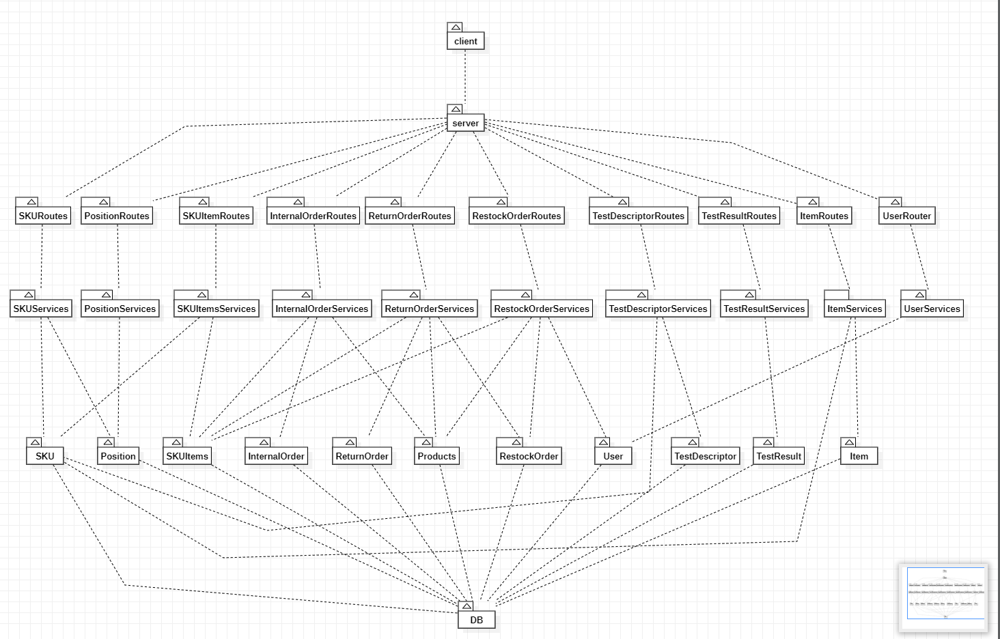

# Integration and API Test Report

Date: 25/05/2022

Version: 1.1

# Contents

- [Dependency graph](#dependency graph)

- [Integration approach](#integration)

- [Tests](#tests)

- [Scenarios](#scenarios)

- [Coverage of scenarios and FR](#scenario-coverage)
- [Coverage of non-functional requirements](#nfr-coverage)

# Dependency graph 

     
# Integration approach
  
     To test all the classes we used a bottom-up approach, we started by testing the DAOs after that we tested the Services and in the end the APIs
     for each class

      step 1: testing DAOs using the database 
      step 2: we tested the Services(B) with all the required DAO classes for each service 
      step 3: we tested the APIs (that use Services) taking care of all the references 

      for example, if we consider the SKUItem class the steps are:
      step 1: testing SKUItem(A2)
      step 2: testing SKUItemServices(B2) that use not only SKUItem(A2) DAO but SKU DAO(A1) too 
      step 3: testing the SKUItem apis(C2) implies using SKUItemServices(B2)  and uses the post of SKU(C1) apis too (C2 + C1 + B2 + A2 + A1)

#  Integration Tests

   <define below a table for each integration step. For each integration step report the group of classes under test, and the names of
     Jest test cases applied to them, and the mock ups used, if any> Jest test cases should be here code/server/unit_test

integration test following the above example:
## Step 1 : DAO test (SKUItem)(A2)
| Classes    | mock up used | Jest test cases                          |
| ---------- | ------------ | ---------------------------------------- |
| SKUItem.js | < no >       | SKUItem.test.js > testGetAll    |
| SKUItem.js | < no >       |  SKUItem.test.js > testNewSKUItem |
| SKUItem.js | < no >       |  SKUItem.test.js > testModifySKUItem          |
| SKUItem.js | < no >       |  SKUItem.test.js > testGetSKUITEMByRFID       |
| SKUItem.js | < no >       | SKUItem.test.js > testGetSKUITEMBySKUID    |
| SKUItem.js | < no >       | SKUItem.test.js > setOrderID      |
| SKUItem.js | < no >       | SKUItem.test.js > setRestockOrder      |
| SKUItem.js | < no >       | SKUItem.test.js > testdeleteSKUItem      |

## Step 2 : test the service (SKUItemService)(B2)

| Classes        | mock up used | Jest test cases                              |
| -------------- | ------------ | -------------------------------------------- |
| SKUItemService.js |  < no >   | SKUItemServices.test.js > createSI    |
| SKUItemService.js |  < no >   | SKUItemServices.test.js > testGet_Modify    |
| SKUItemService.js |  < no >   | SKUItemServices.test.js > testGetRFID    |
| SKUItemService.js |  < no >   | SKUItemServices.test.js > testDelete    |

belove the function used by the skuitemservices tests using the SKU dao (A1)

| Classes        | mock up used | Jest test cases                              |
| -------------- | ------------ | -------------------------------------------- |
| SKU.js |  < no >   | SKUItemServices.test.js > createSKU    |

## Step 3 : testing the api of SKUItem (SKUItemRoutes)(C1)

| Classes    | mock up used | Mocha test cases                    |
| ---------- | ------------ | ----------------------------------- |
| SKUItemRoutes.js | < no >       | testSKUItemRoutes > newSKUItem        |
| SKUItemRoutes.js | < no >       | testSKUItemRoutes > modifyItem        |
| SKUItemRoutes.js | < no >       | testSKUItemRoutes > deleteSKUItem        |

in this step we use the SKU apis too because for foreign key reference a sku must exist to create a skuitem with that skuid (C2)

| Classes    | mock up used | Mocha test cases                    |
| ---------- | ------------ | ----------------------------------- |
| SKURoutes.js | < no >       | testSKUItemRoutes > create sku api   |

# API testing - Scenarios

<If needed, define here additional scenarios for the application. Scenarios should be named
 referring the UC in the OfficialRequirements that they detail>

## Scenario UC1-4

| Scenario |  delete SKU |
| ------------- |:-------------:| 
|  Precondition     | SKU exist in the Database Manager is authenticated and authorized |
|  Post condition     |  SKU is deleted from the Database |
| Step#        | Description  |
|  1     |  Manager searches with ID  |  
|  2     |  Manager selects the SKU's record to delete it |
|  3    | The System deletes the SKU from the DB  |

## Scenario UC1-5

| Scenario |  get SKU |
| ------------- |:-------------:| 
|  Precondition     | SKU exist in the Database Customer is authenticated and authorized |
|  Post condition     |  SKU's informations are provided |
| Step#        | Description  |
|  1     |  Customer searches SKU by ID  |  
|  2     |  System shows the SKU's data  |

## Scenario UC1-6
| Scenario |  get SKU that does not exist |
| ------------- |:-------------:| 
|  Precondition     | SKU does not exist in the Database Customer is authenticated and authorized |
|  Post condition     |  error is shown |
| Step#        | Description  |
|  1     |  Customer searches SKU by ID  |  
|  2     |  System shows an error  |

## Scenario UC4-6

| Scenario |  modify User type |
| ------------- |:-------------:| 
|  Precondition     | User exists Manager is authenticated and authorized |
|  Post condition     |  User's information are updated |
| Step#        | Description  |
|  1     |  Manager searchs the user by username |  
|  2     |  Manager inserts the new type |
|  3     | System updates user information |

## Scenario UC2-6
| Scenario |  get Positions |
| ------------- |:-------------:| 
|  Precondition     | Clerk is authenticated and authorized |
|  Post condition     |   |
| Step#        | Description  |
|  1     |  Clerk selects show positions |  
|  2     |  System shows a list of positions with their information |

## Scenario UC11-3
| Scenario |  delete Item |
| ------------- |:-------------:| 
|  Precondition     | Supplier is authenticated and authorized |
|  Post condition     | Item is deleted from db  |
| Step#        | Description  |
|  1     |  Supplier search item with id |  
|  2     |  Supplier clicks the item to delete it |
|  3     |  System deletes the item from the db |

# Coverage of Scenarios and FR

<Report in the following table the coverage of  scenarios (from official requirements and from above) vs FR. 
Report also for each of the scenarios the (one or more) API Mocha tests that cover it. >  Mocha test cases should be here code/server/test

| Scenario ID     | Functional Requirements covered | Mocha Test(s)    |
| --------------- | ------------------------------- | ---------------- |
| 4-1  |   1.1   | testUserRouter.js -> newUser |
| 7-1  |   //   | testUserRouter.js -> login |
| 1-1  |   2.1   | testSKURouter.js -> newSKU |
| 1-4(see above)  |   2.2   | testSKURouter.js -> deleteSKU |
| 1-5(see above)  |   2.4   | testSKURouter.js -> getSKU |
| 2-1  |   3.1.1   | testPositionRoutes.js -> newPosition |
| 2-5  |   3.1.2   | testPositionRoutes.js -> deletePosition |
| 2-6(see above) |   3.1.3   | testPositionRoutes.js -> getPosition |
| 4-1  |   4.1   | testUserRouter.js -> newUser |
| 4-3  |   4.2   | testUserRouter.js -> deleteUser |
| 4-6(see above)  |   4  | testUserRouter.js -> modifyType |
| // |   5  | testRestockOrderRoute.js -> newRestockOrder |
| // |   5 | testRestockOrderRoutes.js -> getRestockOrder |
| // |   5  | testRestockOrderRoutes.js -> deleteRestockOrder |
| 5-2-1 |   5.8.1  | testSKUItemRoutes.js -> newSKUItem |
| // |   5.8.2  | testTestResultRoutes.js -> createTestResults |
| // |   5.8.3  | testSKUItemRoutes.js -> modifyItem |
| 6-1 |   5.9  | testReturnOrderRoutes.js -> newReturnOrder |
| // |   5.9  | testReturnOrderRoutes.js -> deleteReturnOrder |
| // |   5.9  | testReturnOrderRoutes.js -> getReturnOrderById |
| // |   5.9 | testReturnOrderRoutes.js -> getAllReturnOrders |
| // |   //  | testSKUItemRoutes.js -> deleteItem |
| 9-1 |   6.1  | testInternalOrderRoutes.js -> createInternalOrder |
| // |   6.7  | testInternalOrderRoutes.js -> modifyInternalOrder |
| 9-3 |   6.6  | testInternalOrderRoutes.js -> deleteInternalOrder |
| 11-1 |   7  | testItemRoutes.js -> newItem |
| 11-2 |   7  | testItemRoutes.js -> modifyItem |
| 11-3(see above) |   7  | testItemRoutes.js -> deleteItem |
| // |   7  | testItemRoutes.js -> getItemById |
| // |   7  | testItemRoutes.js -> getAllItems |
| 12 |   //  | testTestDescriptorRoutes.js -> newTestDescriptor |
| 12 |   //  | testTestDescriptorRoutes.js -> modifyTestDescriptor |
| 12 |   //  | testTestDescriptorRoutes.js -> deleteTestDescriptor |
| 12 |   //  | testTestDescriptorRoutes.js -> getTestDescriptorById |
| 12 |   //  | testTestDescriptorRoutes.js -> getAllTestDescriptors |

# Coverage of Non Functional Requirements

<Report in the following table the coverage of the Non Functional Requirements of the application - only those that can be tested with automated testing frameworks.>

### 

| Non Functional Requirement | Test name                 |
| -------------------------- | ------------------------- |
| response time < 0.5s     | included in Mocha* and Jest* | 
| The data of a customer or a supplier should not be disclosed outside the application   |       testUserRouter.js                |
| Position ID is the unique identifier of a position, 12 digits, and is derived from aisle (4digits) row (4 digits) col (4 digits), 4 first digits for aisle, middle 4 for row, last 4 for col |       testPositionRouter.js            |

*If a test is too slow it gives Timeout error

