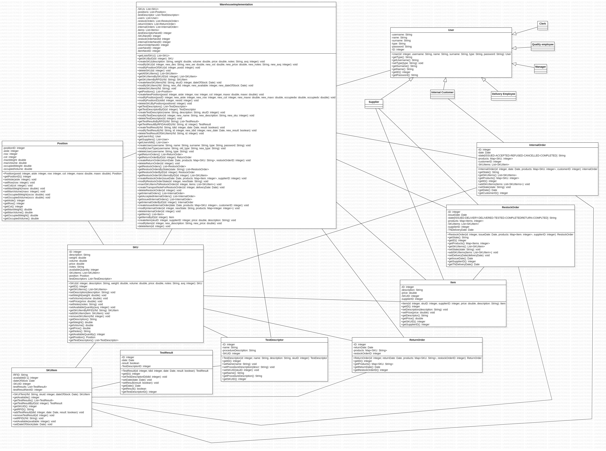

# Design Document 

Authors: Pietro Gancitano, Davide Porello, Gianmarco De Paolis, Alberto Perugini

Date: 23/04/2022

Version: 1.0

# Contents

- [High level design](#package-diagram)
- [Low level design](#class-diagram)
- [Verification traceability matrix](#verification-traceability-matrix)
- [Verification sequence diagrams](#verification-sequence-diagrams)

# Instructions

The design must satisfy the Official Requirements document, notably functional and non functional requirements, and be consistent with the APIs

# High level design 

This architecture implements 2 high-level architectural patterns:
- 3-layer architecture: the basic idea is to use a layered style, to decouple the database (where data likely change often) from application logic (modify and show data of the database). The presentation layer is implemented using the GUI prototype but it's out of scope for the design. Layers are represented with packages in the package diagram.
- client/server: a single server (backend) that contains the application logic and the database, a set of clients/users (frontend) that 
collect and display data from the server using the APIs through the GUI.

## Package diagram

# Low level design

One single class diagram is used to implement the database and the application logic. The structural facade pattern is used to mke the user's experience simple and not affected from eventual future changes in the lower level. The user interacts only with the system through the GUI that interacts with the WarehouseImplementation class, this class provides several methods that are internal implementations of the APIs and manages the interaction between the other classes.

## Class diagram

# Verification traceability matrix

\<for each functional requirement from the requirement document, list which classes concur to implement it>
| ID  | Class1 | Class2 | Class3 |
| --- | ------ | ------ | ------ |
| FR1 | | | |
| FR2 | | | |
| FR3 | | | |
| FR4 | | | |
| FR5 | | | |
| FR6 | | | |
| FR7 | | | |

# Verification sequence diagrams 
\<select key scenarios from the requirement document. For each of them define a sequence diagram showing that the scenario can be implemented by the classes and methods in the design>

