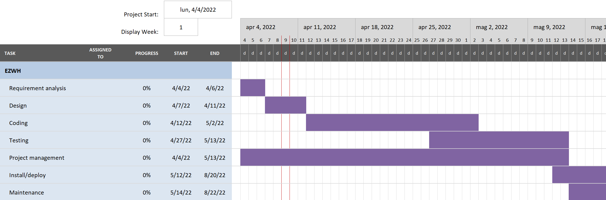

# Project Estimation  
Date: 13/04/2022

Version: 1.0

# Estimation approach
Consider the EZWH  project as described in YOUR requirement document, assume that you are going to develop the project INDEPENDENT of the deadlines of the course
# Estimate by size
### 
|             | Estimate                        |             
| ----------- | ------------------------------- |  
| NC =  Estimated number of classes to be developed   |  30                           |             
|  A = Estimated average size per class, in LOC       |    250                        | 
| S = Estimated size of project, in LOC (= NC * A) | 7500 |
| E = Estimated effort, in person hours (here use productivity 10 LOC per person hour)  |        750                              |   
| C = Estimated cost, in euro (here use 1 person hour cost = 30 euro) | 22500 | 
| Estimated calendar time, in calendar weeks (Assume team of 4 people, 8 hours per day, 5 days per week ) |       5             |               

# Estimate by product decomposition
### 
|         component name    | Estimated effort (person hours)   |             
| ----------- | ------------------------------- | 
|requirement document    |40 |
| GUI prototype |20|
|design document |40|
|code |400|
| unit tests |200|
| api tests |50|
| management documents  |50|

# Estimate by activity decomposition
### 
|         Activity name    | Estimated effort (person hours)   |             
| ----------- | ------------------------------- | 
| Requirement analysis | 100 |
| Design | 50 |
| Coding | 400 |
| Testing | 250 |
| Project management | 100 |
| Install/deploy | unknown |
| Maintenance | unknow |
###
Insert here Gantt chart with above activities

The install/deploy and maintenance phases are not inserted in the estimated effort for the project because they start at the end of the development of the project and last until the project dismissal (as you can see in the Gantt chart), so we cannot estimate their effort.

# Summary

Report here the results of the three estimation approaches. The  estimates may differ. Discuss here the possible reasons for the difference

|             | Estimated effort                        |   Estimated duration |          
| ----------- | ------------------------------- | ---------------|
| estimate by size | 750 person hours | 5 calendar weeks |
| estimate by product decomposition | 800 person hours | 5 calendar weeks |
| estimate by activity decomposition | 900 person hours | 6 calendar weeks |

With the Gantt chart we have increased the estimated effort because we have considered more activities in addition to the first 2 estimations.

