# Graphical User Interface Prototype  

Authors: Pietro Gancitano, Davide Porello, Gianmarco De Paolis, Alberto Perugini

Date: 09/04/2022

Version: 1.0

\<Report here the GUI that you propose. You are free to organize it as you prefer. A suggested presentation matches the Use cases and scenarios defined in the Requirement document. The GUI can be shown as a sequence of graphical files (jpg, png)  >
 
 

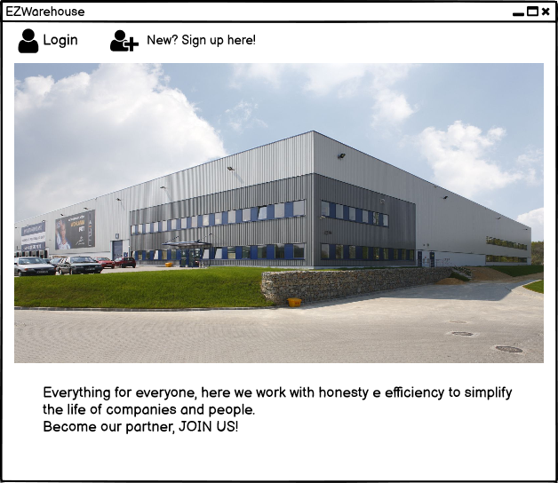
 
1 - Main page of the application, here an user can login or register a new account by clicking on the icons on the navbar
   

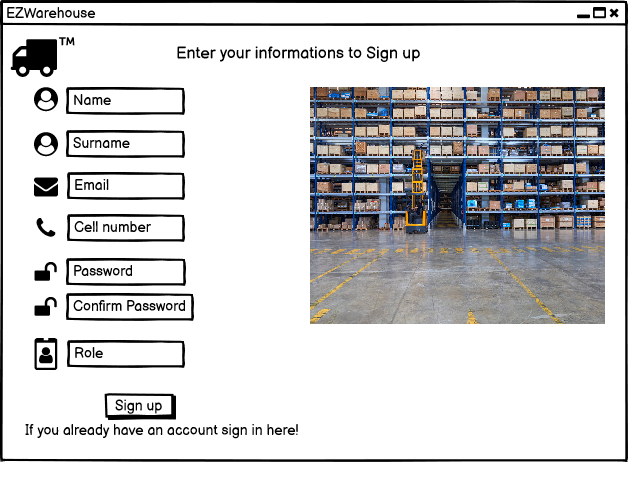
 
Here the user can register his account, he will insert his informations and click on Sign UP button
 
 
 

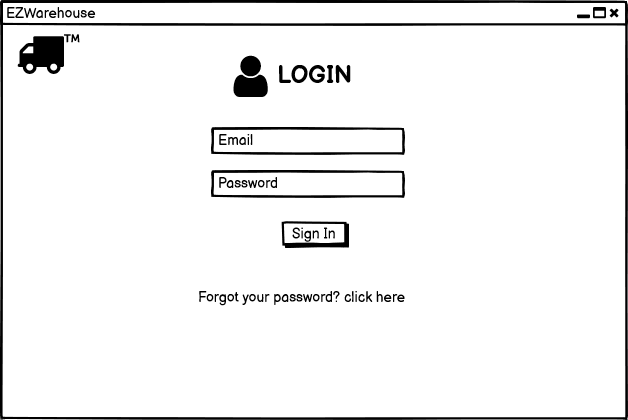
 
After inserting email and password the user clicks Sign In to login into his account, at this point
he is redirected to his mainpage (different if its the WH Manager, a supplier, the WH Worker etc...)
 
 
 

\<NOTE THAT in every page after the login that is not a main page an icon is shown in the up-left corner, this icon
can be used to redirect to the main page of the user logged in (Manager, Worker, Supplier etc...)>
 
 

\<User page>
 
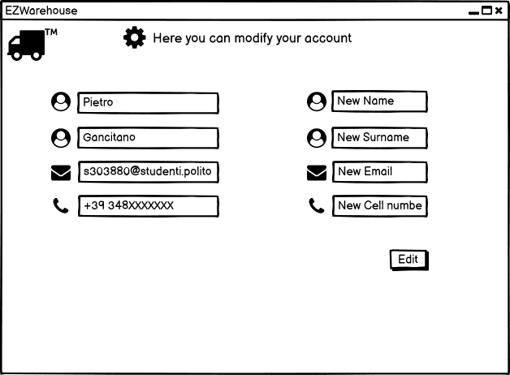
 
Redirected here by clicking on the Manage Account icon the page shows in the left the data about the user
and in the right a form where the user can insert new data to modify his account by then clicking the edit
button
 
 
 

 
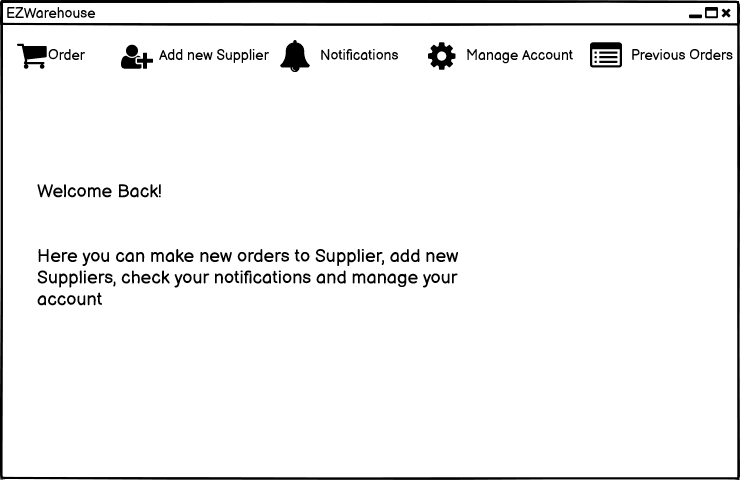
 
This is the Manager's main page after he is authorized and authenticated, there is a navbar with icons that
redirect to each of his functions, like making a new order from a supplier, adding a new supplier, reading 
notifications about internal order or quality check reports and managing the account
 
 
 

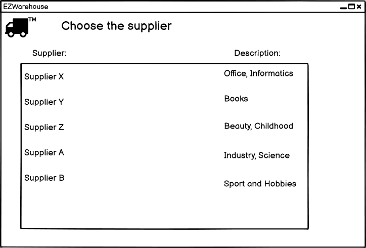
 
After clicking on the Order icon in the navbar the WH Manager is redirected in this page where he has to choose
the supplier from which he wants to order (see business rule in Class Diagram), there he can click on the supplier to go
to the order page
 
 
 

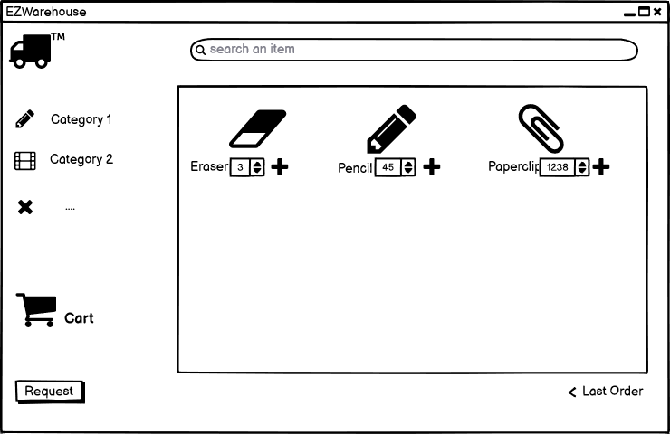
 
After clicking on the Supplier the Manager is redirected in this page in which he can filter the items using the 
category on the left (every item will be shown in the right window, when a filter is clicked only the items 
regarding that category remain) in the right window the manager can choose the item by inserting the number under it
and clicking the plus button, after that the items are in the cart and the order can be confirmed by clicking Request,
Another way to make an order is to click the last order button on the bottom-right corner that insert in the cart the
last order made and then by clicking Request.
 
 
 

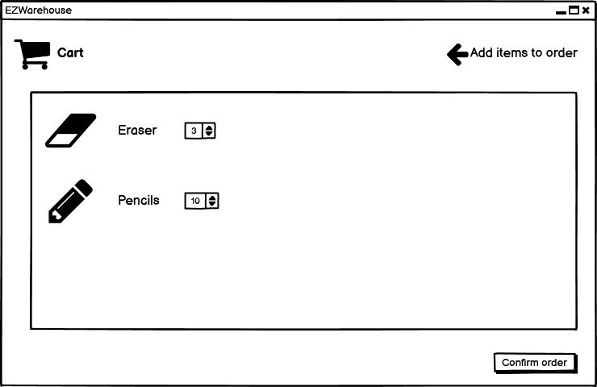
 
Cart GUI to show the items that have been selected
 
 
 

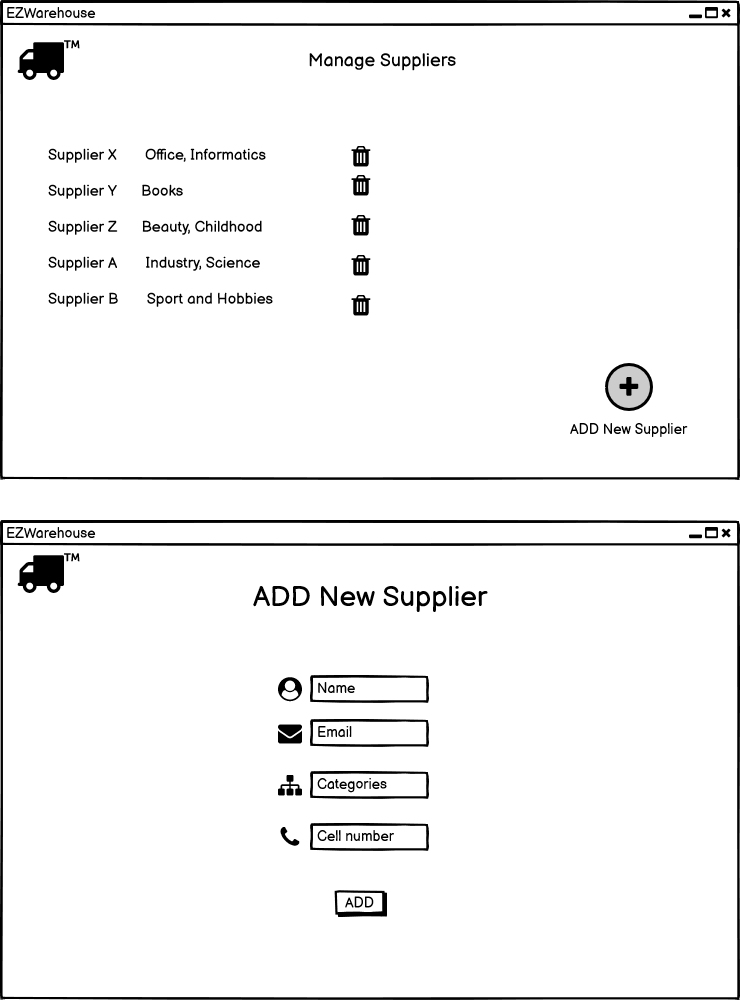
 
By clicking to the Manage Supplier button the Manager is redirected in the Manage supplier page, in this page
he can delete a supplier by clicking to the trash icon in the same row or be redirected to the page below by
clicking on the ADD New Supplier button, there he can insert the informations about the new Supplier and add it
to the DB by clicking ADD button
 
 
 

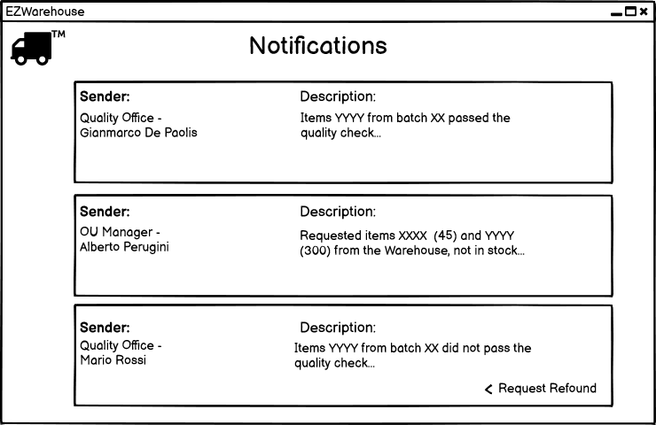
 
The Manager is redirected in this page when clicking on the Notifications icons, in this page he can read notifications
regarding Quality Reports and internal orders, considering NEGATIVE quality reports he can request a refound clicking on
the button with the same name or request missing/broken items to the supplier, a notification is then send to the supplier
 
 
 

 
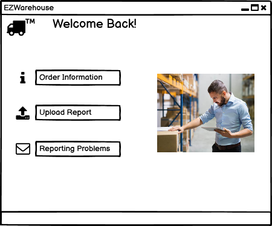
 
Main page of the QO Employee after he is authenticated and authorized, here he can click on the buttons to exploit his functions
 
 
 

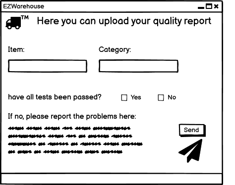
 
Page used by the QO Employee to upload the quality report regarding a batch of an item here he can even
insert a Comment/Description and send the report to the OU Manager
 
 
 

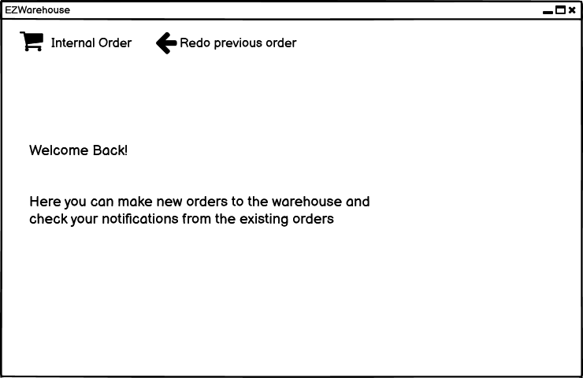
 
Main page of the OU Manager after he is authenticated and authorized, the order page he is redirected to is the
same as the one above (n. 7)
 
 
 

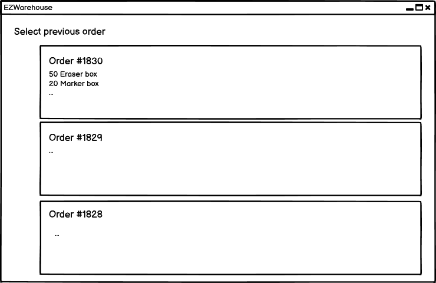
 
Page that has informations about the previous orders, this page can be accessed by the WH Manager (to track old
orders from Suppliers) and by the OU Manager (to track old internal order from the WH)
 
 
 

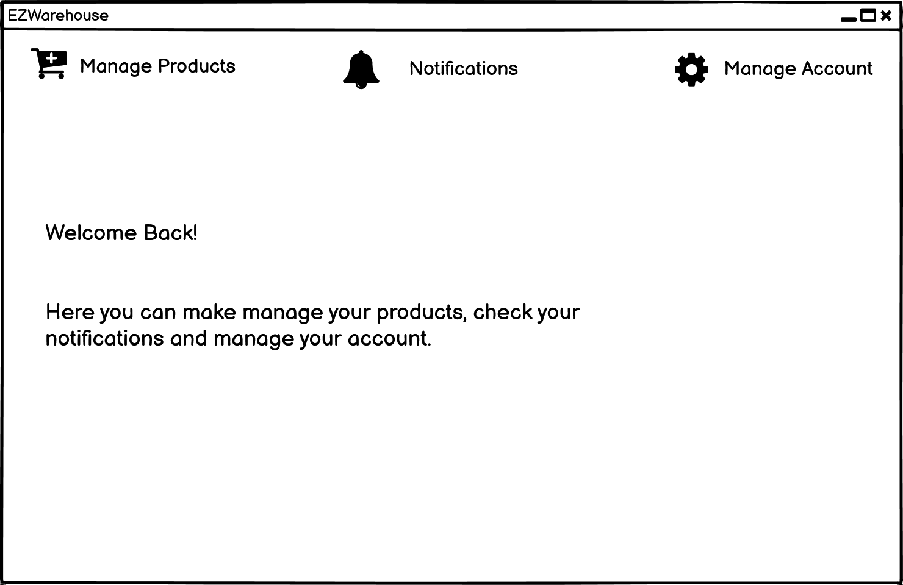
 
Supplier's main page, here he can access to the functionality of Managing products, his notifications and managing
his account using the navbar
 
 
 

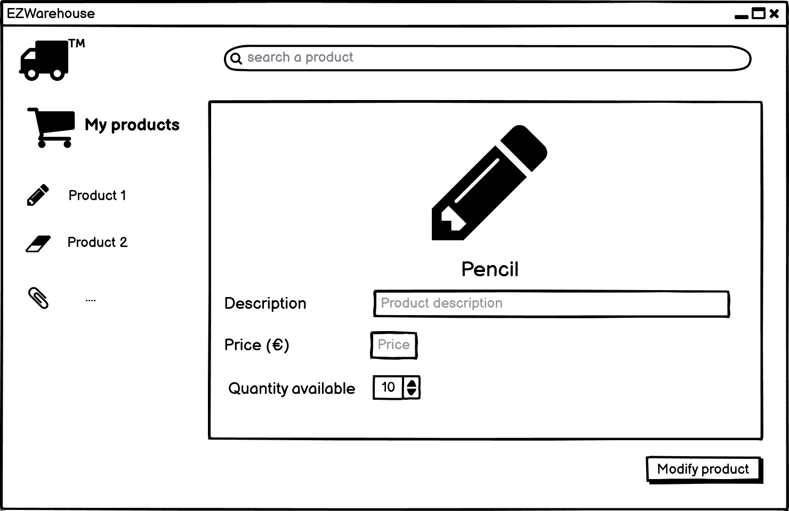
 
The Supplier is redirected in this page by clicking on Manage Products, here he can modify price, quantity and description
 
 
 

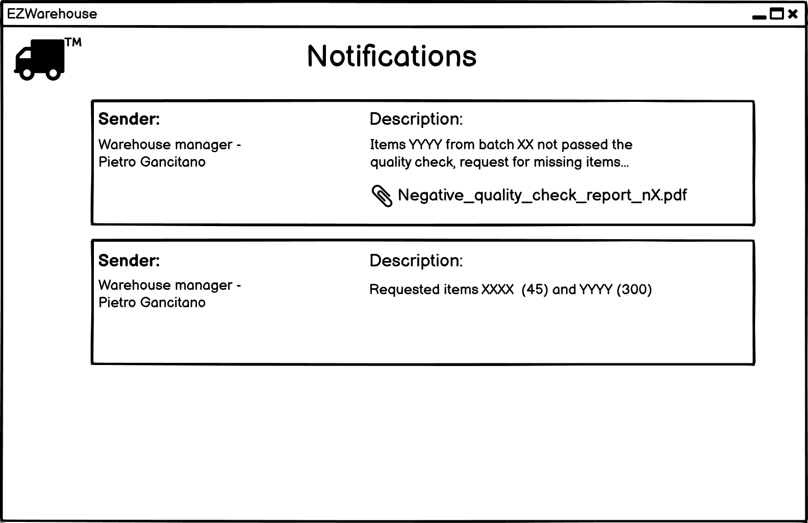
 
Supplier's page of notifications, reached by clicking on the Notifications icon in the Main Page
 
 
 

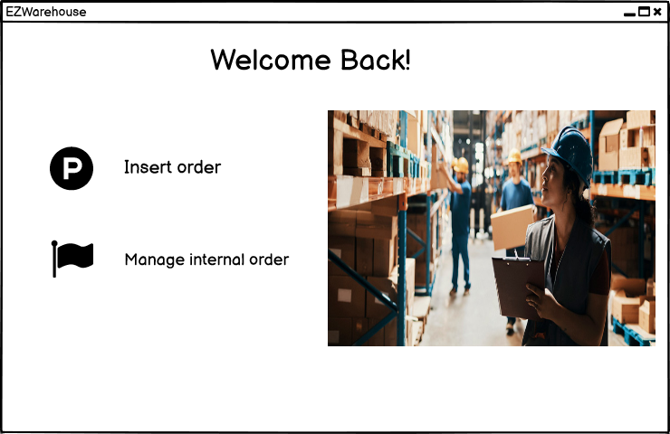
 
Worker's Main Page
 
 
 

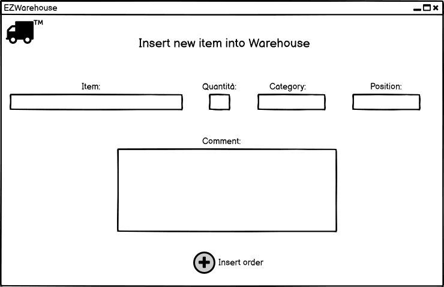
 
The Worker is redirected here by clicking Insert Order icon, in this page the worker can insert the items that
arrived in the WH one by one, defining the position and optionally commenting.
 
 
 

 
When the worker has to modify the status of an order he uses the Manage internal order functionality, he is 
redirected in this page where a list of internal orders is shown with a description and for each the worker
can change the status (even completed ones, as errors/miscomunications can occur)
 
 
 

