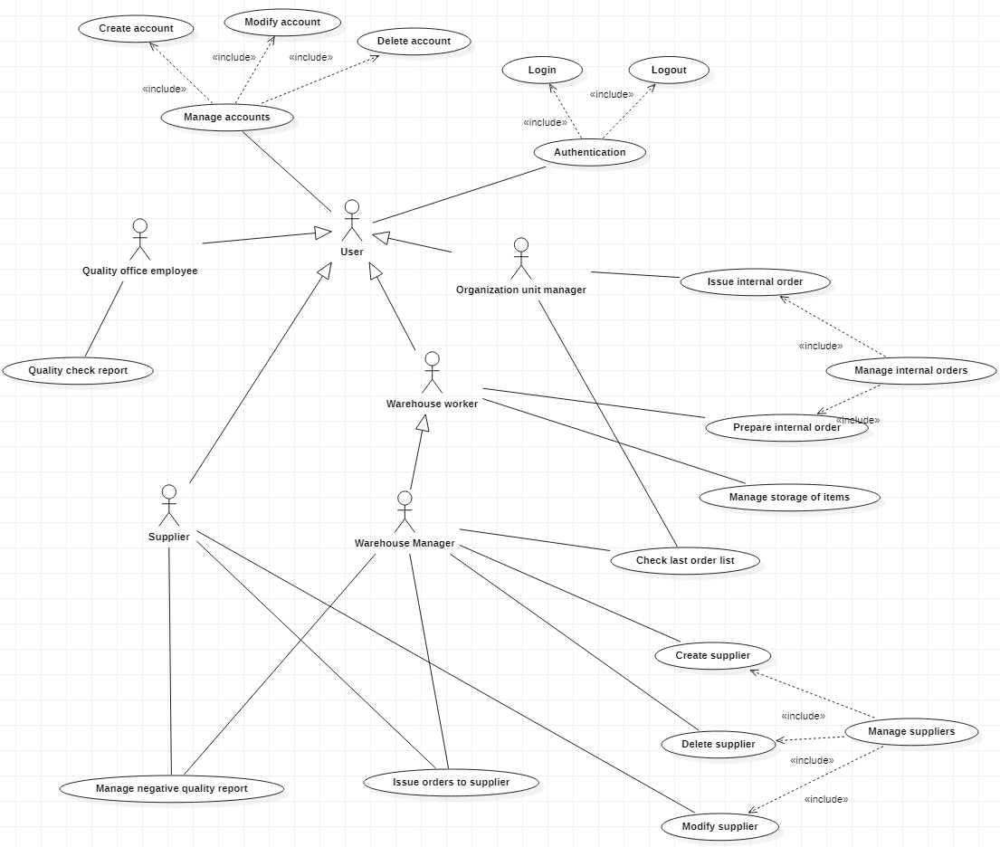

# Requirements Document 

Date: 30 march 2022

Version: 1.0

 
| Version number | Change |
| ----------------- |:-----------|
| 1 | Stakeholders, contex diagram, actors and interfaces | 

# Contents

- [Informal description](#informal-description)
- [Stakeholders](#stakeholders)
- [Context Diagram and interfaces](#context-diagram-and-interfaces)
	+ [Context Diagram](#context-diagram)
	+ [Interfaces](#interfaces) 
	
- [Stories and personas](#stories-and-personas)
- [Functional and non functional requirements](#functional-and-non-functional-requirements)
	+ [Functional Requirements](#functional-requirements)
	+ [Non functional requirements](#non-functional-requirements)
- [Use case diagram and use cases](#use-case-diagram-and-use-cases)
	+ [Use case diagram](#use-case-diagram)
	+ [Use cases](#use-cases)
    	+ [Relevant scenarios](#relevant-scenarios)
- [Glossary](#glossary)
- [System design](#system-design)
- [Deployment diagram](#deployment-diagram)

# Informal description
Medium companies and retailers need a simple application to manage the relationship with suppliers and the inventory of physical items stocked in a physical warehouse. 
The warehouse is supervised by a manager, who supervises the availability of items. When a certain item is in short supply, the manager issues an order to a supplier. In general the same item can be purchased by many suppliers. The warehouse keeps a list of possible suppliers per item. 

After some time the items ordered to a supplier are received. The items must be quality checked and stored in specific positions in the warehouse. The quality check is performed by specific roles (quality office), who apply specific tests for item (different items are tested differently). Possibly the tests are not made at all, or made randomly on some of the items received. If an item does not pass a quality test it may be rejected and sent back to the supplier. 

Storage of items in the warehouse must take into account the availability of physical space in the warehouse. Further the position of items must be traced to guide later recollection of them.

The warehouse is part of a company. Other organizational units (OU) of the company may ask for items in the warehouse. This is implemented via internal orders, received by the warehouse. Upon reception of an internal order the warehouse must collect the requested item(s), prepare them and deliver them to a pick up area. When the item is collected by the other OU the internal order is completed. 

EZWH (EaSy WareHouse) is a software application to support the management of a warehouse.

# Stakeholders

| Stakeholder name  | Description | 
| ----------------- |:-----------:|
|   Retailers/Medium companies 	|	Companies that resell products   | 
|	Warehouse manager/App administrator		| 	Person who manages the warehouse and issues orders, he/she's also the administrator of the app	|
|	Warehouse owner			|	Person who owns the warehouse	|
|	Quality office			|	Internal office of the warehouse who applies specific tests to items to check their quality	|
|	Marketing office		|	Internal office of the warehouse who is in charge to collect the orders from the OUs	|
|	Organization units		|	Parts of the company that issue orders to the warehouse		|
|	Suppliers				| 	Companies that firstly sell the products	|
|	Delivery companies		|	Companies that manage the transport of the items from the suppliers to the warehouse and eventually from the warehouse to the OUs	|
|	Warehouse workers		|	Persons that work inside the warehouse, they manage the placement of the products inside the warehouse|
|   Payment system | Companies that provide payment services (mastercard, paypal, etc..) |
|   Start up partner | Company that has subscribe a partnership with the application |
|   Start up financer | Entities that finance the application |
|   Competitors | Other applications focused on the same topic |
|   Play store/App store | Online app stores where the application is sold |
|   Cloud service | The company that provides cloud services |

# Context Diagram and interfaces

## Context Diagram

## Interfaces

| Actor | Logical Interface | Physical Interface  |
| ------------- |:-------------:| -----:|
|  Warehouse manager (WM)  | GUI | Screen, keyboard |
|  Quality office employee (QOE)	| GUI | Screen, keyboard |
|  Warehouse worker (WW)  | GUI | Screen, keyboard |
|  Supplier	| GUI | Screen, keyboard |
|  Payment system | API | Internet connection |
|  Organizational unit manager (OUM) | GUI | Screen, keyboard |
|  User  |  GUI | Screen, keyboard |

\<A user can be the warehouse manager, a quality office employee, a warehouse worker, an OU manager or a supplier.>

# Stories and personas
\<A Persona is a realistic impersonation of an actor. Define here a few personas and describe in plain text how a persona interacts with the system>

\<Persona is-an-instance-of actor>

\<stories will be formalized later as scenarios in use cases>

# Functional and non functional requirements

## Functional Requirements

\<In the form DO SOMETHING, or VERB NOUN, describe high level capabilities of the system>

\<they match to high level use cases>

| ID        | Description  |
| ------------- |:-------------:| 
|  FR1     |  |
|  FR2     |  |
| FRx..  | | 

## Non Functional Requirements

\<Describe constraints on functional requirements>

| ID        | Type (efficiency, reliability, ..)           | Description  | Refers to |
| ------------- |:-------------:| :-----:| -----:|
|  NFR1     |   |  | |
|  NFR2     | |  | |
|  NFR3     | | | |
| NFRx .. | | | | 

# Use case diagram and use cases

## Use case diagram
\<define here UML Use case diagram UCD summarizing all use cases, and their relationships>

\<next describe here each use case in the UCD>

### Use case 1, Issue orders to supplier
| Actors Involved        | Warehouse manager, Supplier |
| ------------- |:-------------:| 
|  Precondition     | The WM is authenticated and authorized |
|  Post condition     | The order has arrived at the warehouse |
|  Nominal Scenario     | The order arrives |
|  Variants     | The WM uses last order function to make the order |
|  Exceptions     | The quantity of items cannot be accepted |

##### Scenario 1.1 (nominal)

| Scenario 1.1 | The order arrives on time |
| ------------- |:-------------:| 
|  Precondition     | The WM is authenticated and authorized |
|  Post condition     | The order has arrived at the warehouse on time |
| Step#        | Description  |
|  1     | The WM selects the supplier |  
|  2     | The WM choses the items to order and the quantity of each item |
|  3     | The app checks if the quantity of each item is lower of the available space for each item in the warehouse |
|  4	 | The app saves the order and sends via email the order to the supplier |
|  5     | The WM makes the payment to the supplier through the app |
|  6 	 | The app sends the receipt of the payment to the WM |
|  7	 | The order arrives at the warehouse on time |

##### Scenario 1.2 (variant)

| Scenario 1.2 | The WM uses "last order" function to make the order |
| ------------- |:-------------:| 
|  Precondition     | The WM is authenticated and authorized |
|  Post condition     | The order has arrived at the warehouse |
| Step#        | Description  |
|  1     | The WM uses the "last order" function to repeat a previous order |
|  2     | The WM can modify the supplier, the items and their quantity |  
|  3-7   | Same as scenario 1.1 |

##### Scenario 1.3 (exception)

| Scenario 1.3 | The quantity of items cannot be accepted |
| ------------- |:-------------:| 
|  Precondition     | The WM is authenticated and authorized |
|  Post condition     | The order is not accepted by the app |
| Step#        | Description  |
|  1-3   | Same as scenario 1.1 |  
|  4     | The quantity of an item exceeds the available space in the warehouse of that item |
|  5     | The app asks to the WM to modify or delete the order |

### Use case 2, Quality check report
| Actors Involved        | Quality office employee |
| ------------- |:-------------:| 
|  Precondition     | An order has arrived at the warehouse |
|  Post condition     | Quality report is inserted in the on the application |
|  Nominal Scenario     | The order is compliant with quality standards |
|  Variants     |  |
|  Exceptions     | 1. The order has damaged items  2. The order is missing items |

#### Scenario 2.1 (nominal)

| Scenario 2.1 | The order is compliant with quality standards |
| ------------- |:-------------:| 
|  Precondition     | An order has arrived at the warehouse |
|  Post condition     | A positive quality report is inserted in the on the application |
| Step#        | Description  |
|  1     | The quality office employee logs in the application |
|  2     | The quality office employee gets the information on the order they will be inspecting |
|  3     | The quality office employee inspect the items in the order, checking thay they respond to the order on the application |  
|  4     | All the items are as described in the order and in the right quantities |
|  5     | The quality office employee logs in the application the positive quality check on the order page |

#### Scenario 2.2 (exception 1)

| Scenario 2.2 | The order has damaged items |
| ------------- |:-------------:| 
|  Precondition     | An order has arrived at the warehouse |
|  Post condition     | A negative quality report is inserted in the on the application |
| Step#        | Description  |
|  1     | The quality office employee logs in the application |
|  2     | The quality office employee gets the information on the order they will be inspecting |
|  3     | The quality office employee inspect the items in the order, checking thay they respond to the order on the application |  
|  4     | Some items are damaged |
|  5     | The quality office employee logs in the application the negative quality check on the order page, where the damaged items and their quantity is specified |

#### Scenario 2.3 (exception 2)

| Scenario 2.3 | The order is missing items |
| ------------- |:-------------:| 
|  Precondition     | An order has arrived at the warehouse |
|  Post condition     | A negative quality report is inserted in the on the application |
| Step#        | Description  |
|  1     | The quality office employee logs in the application |
|  2     | The quality office employee gets the information on the order they will be inspecting |
|  3     | The quality office employee inspect the items in the order, checking thay they respond to the order on the application |  
|  4     | Some items are missing compared to the order on the application |
|  5     | The quality office employee logs in the application the negative quality check on the order page, where the missing items and their quantity is specified

### Use case 3, Manage internal orders

### Use case 3.1, Issue internal order

| Actors Involved        | Organizational unit manager, Warehouse manager |
| ------------- |:-------------:| 
|  Precondition     | OU Manager is authenticated and authorized |
|  Post condition     | Order is sent to the Warehouse's DB with status "on pending" |
|  Nominal Scenario     | Issue order |
|  Variants     |  Manager orders using last order function	|
|  Exceptions     | 1. All the items asked(quantity) are not in stock  2. Some of the items asked are not in stock, OU Manager continues order excluding those  3. Some of the items asked are not in stock, OU Manager aborts order |

#### Scenario 3.1.1 (nominal)

| Scenario 3.1.1 | Issue order |
| ------------- |:-------------:| 
|  Precondition     | OU Manager is authenticated and authorized |
|  Post condition     | Order is sent to the Warehouse's DB with status "on pending" |
| Step#  | Description  |
|  1     | OU Manager asks for item(s) in the warehouse |  
|  2     | Application asks the quantity of the item(s) needed |
|  3	 | OU Manager enter the quantity and confirms |
|  4	 | Application checks if the quantity asked for each item is in stock or not |
|  5 	 | Application sends the order to the WH |

#### Scenario 3.1.2 (variant)

| Scenario 3.1.2 | Manager orders using last order function |
| ------------- |:-------------:| 
|  Precondition     | OU Manager is authenticated and authorized |
|  Post condition   | Order is sent to the Warehouse's DB with status "on pending" |
| Step#  | Description  |
|  1     | OU Manager asks to redo the last order and confirms |  
|  2	 | Application checks if the quantity asked is in stock or not |
|  3 	 | Application sends the order to the WH |

#### Scenario 3.1.3 (exception 1)

| Scenario 3.1.3 | Some of the items asked are not in stock, OU Manager continues order excluding those |
| ------------- |:-------------:| 
|  Precondition     | OU Manager is authenticated and authorized |
|  Post condition     | Order is sent to the Warehouse's DB with status "on pending" A notification regarding this order is sent to the Warehouse Manager |
| Step#  | Description  |
|  1     | OU Manager asks for items in the warehouse |  
|  2     | Application asks the quantity of the items needed |
|  3	 | OU Manager enter the quantity and confirms |
|  4	 | Application checks if the quantity asked for each item is in stock or not |
|  5 	 | Application notifies that the quantity asked for some of the items is not in stock |
|  6	 | Application asks if you want to continue your order excluding the missing item(s) from the request |
|  7 	 | OU Manager confirms |
|  8 	 | Application sends the order and the notification to the WH Manager |

#### Scenario 3.1.4 (exception 2)

| Scenario 3.1.4 | Some of the items asked are not in stock, OU Manager aborts order |
| ------------- |:-------------:| 
|  Precondition     | OU Manager is authenticated and authorized |
|  Post condition   | A notification regarding this order is sent to the Warehouse Manager |
| Step#  | Description  |
|  1     | OU Manager asks for items in the warehouse |  
|  2     | Application asks the quantity of the items needed |
|  3	 | OU Manager enter the quantity and confirms |
|  4	 | Application checks if the quantity asked for each item is in stock or not |
|  5 	 | Application notifies that the quantity asked for some of the items is not in stock |
|  6	 | Application asks if you want to continue your order excluding the missing item(s) from the request |
|  7 	 | OU Manager rejects |
|  8	 | Application sends the notification to the WH Manager |

\<The notification tells the WH Manager the need to order the item(s) from a supplier to satisfy this request>

#### Scenario 3.1.5 (exception 3)

| Scenario 3.1.5 | All the items asked(quantity) are not in stock |
| ------------- |:-------------:| 
|  Precondition     | OU Manager is authenticated and authorized |
|  Post condition     | A notification regarding this order is sent to the Warehouse Manager |
| Step#  | Description  |
|  1     | OU Manager asks for item(s) in the warehouse |  
|  2     | Application asks the quantity of the item(s) needed |
|  3	 | OU Manager enter the quantity and confirms |
|  4	 | Application checks if the quantity asked for each item is in stock or not |
|  5 	 | Application notifies that the quantity asked for each of the items is NOT in stock |
|  6	 | Application sends the notification to the WH Manager |

### Use case 3.2, Prepare internal order

| Actors Involved        | Warehouse worker, Organizational unit manager |
| ------------- |:-------------:| 
|  Precondition | An internal order is issued WH Worker is authenticated and authorized |					
|  Post condition     | Order status has been changed OU Manager has been notified  |
|  Nominal Scenario     | Preparing and delivering order |
|  Variants     | 						|
|  Exceptions     | 		 |

#### Scenario 3.2.1 (nominal)
			
| Scenario 3.2.1 | Preparing and delivering order |
| ------------- |:-------------:| 
|  Precondition     | An internal order is issued WH Worker is authenticated and authorized |
|  Post condition     | Order status is "Completed" The OU Manager is notified |
| Step#  | Description  |
|  1     | WH Worker accepts the order and starts preparing the item(s) |  
|  2     | Applications changes order status to "Preparing"  |
|  3	 | When item(s) are in the pick-up area, WH Worker notifies the application |
|  4	 | Application changes order status to "Completed" |
|  5     | Application notifies the OU Manager |

\<we consider that internal order cannot be refused, so no exceptions>

### Use case 4, Manage storage of items

| Actors Involved | Warehouse worker, Quality office employee |
| ------------- |:-------------:| 
|  Precondition | WH Worker is authenticated and authorized Items have passed the quality check |				
|  Post condition    | Items has been stored and tracked in the warehouse | 
|  Nominal Scenario     |  WH Worker stores the items in a specific position  |
|  Variants     | 						|
|  Exceptions   |                       |

#### Scenario 4.1 (nominal)
 
| Scenario 4.1 | WH Worker stores the items in a specific position |
| ------------- |:-------------:| 
|  Precondition     | An order has arrived at the warehouse with positive quality report |
|  Post condition     | The items are stored in a specific place |
| Step#        | Description  |
|  1     | The warehouse workers logs in the application |
|  2     | The warehouse workers gets the information on the order they will store |
|  3     | The warehouse workers stores the item in the warehouse saving their location |  
|  4     | All the items are stored and tracked |

### Use case 5, Manage negative quality report

### Use case 5.1, Manage negative quality report - missing items
| Actors Involved        | Warehouse manager  |
| ------------- |:-------------:| 
|  Precondition     | An order has recieved a negative quality report because of missing items |
|  Post condition     | The supplier is informed of the report and of what will happen to the order |
|  Nominal Scenario     | The manager asks for the delivery of the missing items |
|  Variants     | 1. The manager asks for the refound of the missing items  2. The manager sends back the incorrect order |
|  Exceptions   |  |

#### Scenario 5.1.1 (nominal)

| Scenario 5.1.1 | The manager asks for the delivery of the missing items |
| ------------- |:-------------:| 
|  Precondition     | An order has recieved a negative quality report for missing items|
|  Post condition     | The supplier is informed of the report and asked for the delivery of the missing items |
| Step#        | Description  |
|  1     | The manager recives the negative report on his dashboard |
|  2     | Given the specific situation, he decides it is best to ask for the delivery of the missing items |
|  3     | The manager clicks on the button to contact the supplier |
|  4     | The manager select that he wants the missing items to be sent |
|  5     | A new order is created - see use case 1 |
|  6     | The quality report of the order is sent to the supplier |

#### Scenario 5.1.2 (variant 1)

| Scenario 5.1.2 | The manager asks for the refound of the missing items |
| ------------- |:-------------:| 
|  Precondition     | An order has recieved a negative quality report for missing items|
|  Post condition     | The supplier is informed of the report and asked for the refound of the missing items |
| Step#        | Description  |
|  1     | The manager recives the negative report on his dashboard |
|  2     | Given the specific situation, he decides it is best to ask for the refound of the  missing items |
|  3     | The manager clicks on the button to contact the supplier |
|  4     | The manager select that he wants the missing items to be refounded |
|  5     | The quality report of the order and the request are sent to the supplier |

#### Scenario 5.1.3 (variant 2)

| Scenario 5.1.3 | The manager sends back the incorrect order |
| ------------- |:-------------:| 
|  Precondition     | An order has recieved a negative quality report for missing items|
|  Post condition     | The supplier is informed of the report and sent back order |
| Step#        | Description  |
|  1     | The manager recives the negative report on his dashboard |
|  2     | Given the specific situation, he decides it is best to send the order back to the supplier |
|  3     | The manager clicks on the button to contact the supplier |
|  4     | The manager select that he wants the order to be sent back |
|  5     | The quality report of the order and the request are sent to the supplier |
|  6     | The order is sent back |

### Use case 5.2, Manage negative quality report - damaged items
| Actors Involved        | Warehouse manager  |
| ------------- |:-------------:| 
|  Precondition     | An order has recieved a negative quality report because of damaged items |
|  Post condition     | The supplier is informed of the report and of what will happen to the order |
|  Nominal Scenario     | The manager asks for the delivery of the damaged items |
|  Variants     | 1. The manager asks for the refound of the damaged items  2. The manager sends back the incorrect order   3. The manager sends back the part of the incorrect order containing the damaged items |
|  Exceptions   |  |

#### Scenario 5.2.1 (nominal)

| Scenario 5.2.1 | The manager asks for the delivery of the damaged items |
| ------------- |:-------------:| 
|  Precondition     | An order has recieved a negative quality report because of damaged items ||  Post condition     | The supplier is informed of the report and asked for the delivery of the damaged items |
| Step#        | Description  |
|  1     | The manager recives the negative report on his dashboard |
|  2     | Given the specific situation, he decides it is best to ask for the delivery of the damaged items |
|  3     | The manager clicks on the button to contact the supplier |
|  4     | The manager select that he wants the damaged items to be sent |
|  5     | A new order is created - see use case 1 |
|  6     | The quality report of the order is sent to the supplier |

#### Scenario 5.2.2 (variant 1)

| Scenario 5.2.2 | The manager asks for the refound of the damaged items |
| ------------- |:-------------:| 
|  Precondition     | An order has recieved a negative quality report because of damaged items ||  Post condition     | The supplier is informed of the report and asked for the refound of the damaged items |
| Step#        | Description  |
|  1     | The manager recives the negative report on his dashboard |
|  2     | Given the specific situation, he decides it is best to ask for the refound of the  damaged items |
|  3     | The manager clicks on the button to contact the supplier |
|  4     | The manager select that he wants the damaged items to be refounded |
|  5     | The quality report of the order and the request are sent to the supplier |

#### Scenario 5.2.3 (variant 2)

| Scenario 5.2.3 | The manager sends back the incorrect order |
| ------------- |:-------------:| 
|  Precondition     | An order has recieved a negative quality report because of damaged items ||  Post condition     | The supplier is informed of the report and sent back the whole order |
| Step#        | Description  |
|  1     | The manager recives the negative report on his dashboard |
|  2     | Given the specific situation, he decides it is best to send the order back to the supplier |
|  3     | The manager clicks on the button to contact the supplier |
|  4     | The manager select that he wants the order to be sent back |
|  5     | The quality report of the order and the request are sent to the supplier |
|  6     | The order is sent back |

#### Scenario 5.2.4 (variant 3)

| Scenario 5.2.4 | Variant: send back damaged items |
| ------------- |:-------------:| 
|  Precondition     | An order has recieved a negative quality report because of damaged items ||  Post condition     | The supplier is informed of the report and sent back the damaged part of the order |
| Step#        | Description  |
|  1     | The manager recives the negative report on his dashboard |
|  2     | Given the specific situation, he decides it is best to send the order back to the supplier |
|  3     | The manager clicks on the button to contact the supplier |
|  4     | The manager select that he wants the damaged items to be sent back |
|  5     | The quality report of the order and the request are sent to the supplier |
|  6     | The order with the damaged items is sent back |

### Use case 6, Authentication

### Use case 6.1, Login
| Actors Involved        | User |
| ------------- |:-------------:| 
|  Precondition     | The user has an account |
|  Post condition     | The user is authenticated |
|  Nominal Scenario     | The user logs in successfully |
|  Variants     |  |
|  Exceptions     | 1. The username is wrong   2. The password is wrong |

### Use case 6.2, Logout
| Actors Involved        | User |
| ------------- |:-------------:| 
|  Precondition     | The user is logged in |
|  Post condition     | The user is logged out |
|  Nominal Scenario     | The user logs out successfully |
|  Variants     | |
|  Exceptions     | |

### Use case 7, Manage suppliers

### Use case 7.1, Create supplier
| Actors Involved        | WM |
| ------------- |:-------------:| 
|  Precondition     | The Warehouse Manager is authenticated and authorized  |
|  Post condition     | The supplier is added to the list |
|  Nominal Scenario     | Add new supplier |
|  Variants     | |
|  Exceptions     | |

### Use case 7.2, Modify supplier
| Actors Involved        | Supplier |
| ------------- |:-------------:| 
|  Precondition     | The supplier is authenticated and authorized  |
|  Post condition     | The supplier modifies his account |
|  Nominal Scenario     | Modify price of an item |
|  Variants     | 1. Add new items sold  2. Delete items no more sold |
|  Exceptions     | |

### Use case 7.3, Delete supplier
| Actors Involved        | WM |
| ------------- |:-------------:| 
|  Precondition     | The Warehouse Manager is authenticated and authorized  |
|  Post condition     | The supplier is delete |
|  Nominal Scenario     | Delete an existing supplier |
|  Variants     | |
|  Exceptions     |  |

### Use case 7, Manage accounts

### Use case 7.1, Create account
| Actors Involved        | User |
| ------------- |:-------------:| 
|  Precondition     | The user doesn't have an account |
|  Post condition     | A new account is created |
|  Nominal Scenario     | Create new account |
|  Variants     | |
|  Exceptions     | 1. Email not valid   2. Password not valid |

### Use case 7.2, Modify account
| Actors Involved        | User |
| ------------- |:-------------:| 
|  Precondition     | The user has an account |
|  Post condition     | The account is modified |
|  Nominal Scenario     | Change the password of the account |
|  Variants     | 1. Modify the username of the account   2. Modify the email of the account |
|  Exceptions     |  |

### Use case 7.3, Delete account
| Actors Involved        | User |
| ------------- |:-------------:| 
|  Precondition     | The user has an account |
|  Post condition     | The account is deleted |
|  Nominal Scenario     | Delete an existing account |
|  Variants     |  |
|  Exceptions     |  |

# Glossary

\<use UML class diagram to define important terms, or concepts in the domain of the system, and their relationships> 

\<concepts are used consistently all over the document, ex in use cases, requirements etc>

# System Design
\<describe here system design>

\<must be consistent with Context diagram>

# Deployment Diagram

\<describe here deployment diagram >

