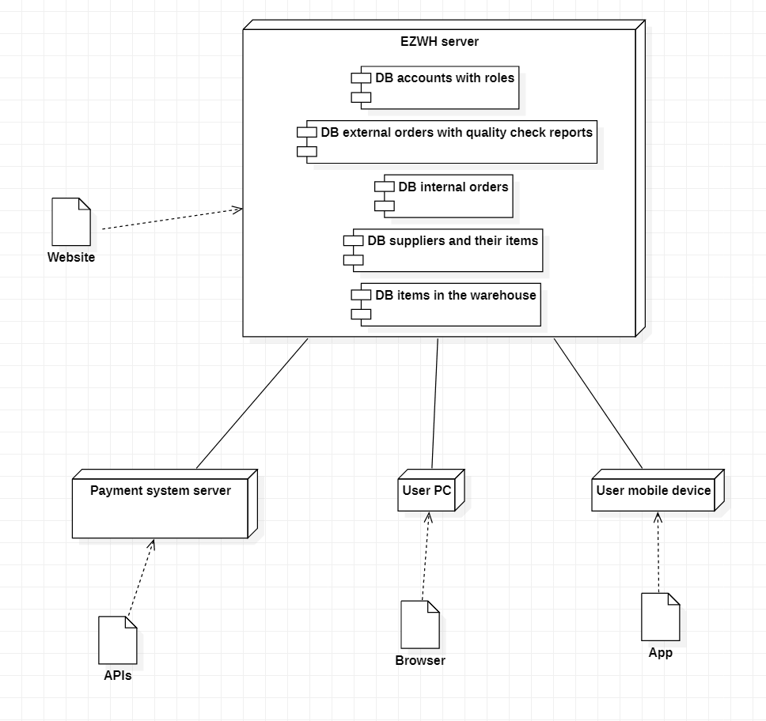

# Requirements Document 

Date: 6 april 2022

Version: 1.3

 
| Version number | Change |
| ----------------- |:-----------|
| 1.0 | Stakeholders, contex diagram, actors and interfaces |
| 1.1 | Use cases, use case diagram, glossary | 
| 1.2 | Deployment diagram, stories and personas, FRs, NFRs, system design |
| 1.3 | Completed first version of requirements document |

# Contents

- [Informal description](#informal-description)
- [Stakeholders](#stakeholders)
- [Context Diagram and interfaces](#context-diagram-and-interfaces)
	+ [Context Diagram](#context-diagram)
	+ [Interfaces](#interfaces) 
	
- [Stories and personas](#stories-and-personas)
- [Functional and non functional requirements](#functional-and-non-functional-requirements)
	+ [Functional Requirements](#functional-requirements)
	+ [Non functional requirements](#non-functional-requirements)
- [Use case diagram and use cases](#use-case-diagram-and-use-cases)
	+ [Use case diagram](#use-case-diagram)
	+ [Use cases](#use-cases)
	+ [Relevant scenarios](#relevant-scenarios)
- [Glossary](#glossary)
- [System design](#system-design)
- [Deployment diagram](#deployment-diagram)

# Informal description
Medium companies and retailers need a simple application to manage the relationship with suppliers and the inventory of physical items stocked in a physical warehouse. 
The warehouse is supervised by a manager, who supervises the availability of items. When a certain item is in short supply, the manager issues an order to a supplier. In general the same item can be purchased by many suppliers. The warehouse keeps a list of possible suppliers per item. 

After some time the items ordered to a supplier are received. The items must be quality checked and stored in specific positions in the warehouse. The quality check is performed by specific roles (quality office), who apply specific tests for item (different items are tested differently). Possibly the tests are not made at all, or made randomly on some of the items received. If an item does not pass a quality test it may be rejected and sent back to the supplier. 

Storage of items in the warehouse must take into account the availability of physical space in the warehouse. Further the position of items must be traced to guide later recollection of them.

The warehouse is part of a company. Other organizational units (OU) of the company may ask for items in the warehouse. This is implemented via internal orders, received by the warehouse. Upon reception of an internal order the warehouse must collect the requested item(s), prepare them and deliver them to a pick up area. When the item is collected by the other OU the internal order is completed. 

EZWH (EaSy WareHouse) is a software application to support the management of a warehouse.

# Stakeholders

| Stakeholder name  | Description | 
| ----------------- |:-----------:|
|   Retailers/Medium companies 	|	Companies that resell products   | 
|	Warehouse manager/App administrator		| 	Person who manages the warehouse and issues orders, he/she's also the administrator of the app	|
|	Warehouse owner			|	Person who owns the warehouse	|
|	Quality office			|	Internal office of the warehouse who applies specific tests to items to check their quality	|
|	Marketing office		|	Internal office of the warehouse who is in charge to collect the orders from the OUs	|
|	Organization units		|	Parts of the company that issue orders to the warehouse		|
|	Suppliers				| 	Companies that firstly sell the products	|
|	Delivery companies		|	Companies that manage the transport of the items from the suppliers to the warehouse and eventually from the warehouse to the OUs	|
|	Warehouse workers		|	Persons that work inside the warehouse, they manage the placement of the products inside the warehouse|
|   Payment system | Companies that provide payment services (mastercard, paypal, etc..) |
|   Start up partner | Company that has subscribe a partnership with the application |
|   Start up financer | Entities that finance the application |
|   Competitors | Other applications focused on the same topic |
|   Play store/App store | Online app stores where the application is sold |
|   Cloud service | The company that provides cloud services |

# Context Diagram and interfaces

## Context Diagram

The software shows different data depending on the type of user that logs in.

## Interfaces

| Actor | Logical Interface | Physical Interface  |
| ------------- |:-------------:| -----:|
|  Warehouse (WH) manager  | GUI | Screen, keyboard |
|  Quality office (QO) employee 	| GUI | Screen, keyboard |
|  Warehouse worker   | GUI | Screen, keyboard |
|  Supplier	| GUI | Screen, keyboard |
|  Payment system | API | Internet connection |
|  Organizational unit (OU) manager  | GUI | Screen, keyboard |
|  User  |  GUI | Screen, keyboard |

A user can be the WH manager, a QO employee, a WH worker, an OU manager or a supplier.

# Stories and personas
\<A Persona is a realistic impersonation of an actor. Define here a few personas and describe in plain text how a persona interacts with the system>

\<Persona is-an-instance-of actor>

\<stories will be formalized later as scenarios in use cases>

# Functional and non functional requirements

## Functional Requirements

| ID                  | Description  |
| ------------------- |:-------------:| 
|  FR1                | Manage order |
|  &ensp;FR1.1        | Create new order |
|  &ensp;FR1.2        | Add item to order |
|  &ensp;FR1.3        | Send order to supplier |
|  &ensp;FR1.4        | Create order from previous one |
|  &ensp;FR1.4        | Set order as received |
|  &ensp;FR1.5        | List available items to order |
|  FR2                | Manage quality reports |
|  &ensp;FR2.1        | Upload quality report for an order |
|  &ensp;FR2.2        | Attach quality report to message sent to the supplier |
|  FR3                | Manage internal order | 
|  &ensp;FR3.1        | Create internal order |
|  &ensp;FR3.2        | Add items and quantity |
|  &ensp;FR3.3        | Check availability in the warehouse |
|  &ensp;FR3.4        | Notify warehous manager of the order |
|  FR4                | Manage storage of items |
|  &ensp;FR4.1        | Keep track of avaible space |
|  &ensp;FR4.2        | Keep track of the position of items inside the warehouse |
|  &ensp;FR4.3        | Put an item in a specific position in the warehouse |
|  FR5                | Manage negative quality report |
|  &ensp;FR5.1        | Select action required to manage the order |
|  &ensp;FR5.2        | Send message to the supplier with the decision |
|  FR6                | Authentication |
|  &ensp;FR6.1        | Login |
|  &ensp;FR6.2        | Logout |
|  FR7                | Manage suppliers |
|  &ensp;FR7.1        | List existing suppliers with their items and prices |
|  &ensp;FR7.2        | Add new supplier |
|  &ensp;FR7.3        | Modify existing supplier |
|  &ensp;FR7.4        | Delete existing supplier |
|  FR8                | Manage account |
|  &ensp;FR8.1        | Create account |
|  &ensp;FR8.2        | Delete account |
|  &ensp;FR8.3        | Modify account |

## Non Functional Requirements

| ID        | Type           | Description  | Refers to FR |
| ------------- |:-------------:| :-----:| -----:|
| NFR1      | Efficiency | Response time for all functions should be < 0.5 sec | All |
| NFR2      | Reliability | MTBF < 1 defect per user per year | None | 
| NFR3      | Security | Privacy of data | All |
| NFR4      | Efficiency |  RAM < 0.5GB and disk < 10GB | None |
| NFR5      | Usability | Time to learn to use the software < 1 hour | None |
| NFR6      | Maintainability | One software update every year | None |
| NFR7      | Avaliability | Countries where the software will be sold | None |
| NFR8      | Safety | Make order with a valid quantity | FR1 |

# Use case diagram and use cases

## Use case diagram

## Use cases

### Use case 1, Issue orders to supplier
| Actors Involved        | Warehouse manager, Supplier |
| ------------- |:-------------:| 
|  Precondition     | The warehouse manager is authenticated and authorized |
|  Post condition     | The order has arrived at the warehouse |
|  Nominal Scenario     | The order arrives |
|  Variants     | The warehouse manager uses last order function to make the order |
|  Exceptions     | The quantity of items cannot be accepted |

##### Scenario 1.1 (nominal)
| Scenario 1.1 | The order arrives on time |
| ------------- |:-------------:| 
|  Precondition     | The warehouse manager is authenticated and authorized |
|  Post condition     | The order has arrived at the warehouse on time |
| Step#        | Description  |
|  1     | The warehouse manager selects the supplier |  
|  2     | The warehouse manager choses the items to order and the quantity of each item |
|  3     | The app checks if the quantity of each item is lower of the available space for each item in the warehouse |
|  4	 | The app saves the order in the DB and sends via email the order to the supplier |
|  5     | The warehouse manager makes the payment to the supplier through the app |
|  6 	 | The app sends the receipt of the payment to the warehouse manager |
|  7	 | The order arrives at the warehouse on time |

##### Scenario 1.2 (variant)
| Scenario 1.2 | The WM uses "last order" function to make the order |
| ------------- |:-------------:| 
|  Precondition     | The warehouse manager is authenticated and authorized |
|  Post condition     | The order has arrived at the warehouse |
| Step#        | Description  |
|  1     | The warehouse manager uses the "last order" function to repeat a previous order |
|  2     | The warehouse manager can modify the supplier, the items and their quantity |  
|  3-7   | Same as scenario 1.1 |

##### Scenario 1.3 (exception)
| Scenario 1.3 | The quantity of items cannot be accepted |
| ------------- |:-------------:| 
|  Precondition     | The warehouse manager is authenticated and authorized |
|  Post condition     | The order is not accepted by the app |
| Step#        | Description  |
|  1-3   | Same as scenario 1.1 |  
|  4     | The quantity of an item exceeds the available space in the warehouse of that item |
|  5     | The app asks to the warehouse manager to modify or delete the order |

### Use case 2, Quality check report
| Actors Involved        | Quality office employee |
| ------------- |:-------------:| 
|  Precondition     | An order has arrived at the warehouse |
|  Post condition     | Quality report is inserted in the on the application |
|  Nominal Scenario     | The order is compliant with quality standards |
|  Variants     |  |
|  Exceptions     | 1. The order has damaged items  2. The order has missing items |

#### Scenario 2.1 (nominal)
| Scenario 2.1 | The order is compliant with quality standards |
| ------------- |:-------------:| 
|  Precondition     | An order has arrived at the warehouse |
|  Post condition     | A positive quality report is uploaded in the application |
| Step#        | Description  |
|  1     | The quality office employee logs in the application |
|  2     | The quality office employee gets the information on the order they will be inspecting |
|  3     | The quality office employee inspects the items in the order, checking that they respond to the order on the application |  
|  4     | All the items are as described in the order and in the right quantities |
|  6     | The quality office employee uploads in the application the positive quality check report on the order page |

#### Scenario 2.2 (exception 1)
| Scenario 2.2 | The order has damaged items |
| ------------- |:-------------:| 
|  Precondition     | An order has arrived at the warehouse |
|  Post condition     | A negative quality report is uploaded in the application |
| Step#        | Description  |
|  1     | The quality office employee logs in the application |
|  2     | The quality office employee gets the information on the order they will be inspecting |
|  3     | The quality office employee inspect the items in the order, checking thay they respond to the order on the application |  
|  4     | Some items are damaged |
|  5     | The quality office employee uploads in the application the negative quality check report on the order page specifying the damaged items and their quantity|
|  6     | The applications send a negative quality report notification the the WH manager |

#### Scenario 2.3 (exception 2)
| Scenario 2.3 | The order has missing items |
| ------------- |:-------------:| 
|  Precondition     | An order has arrived at the warehouse |
|  Post condition     | A negative quality report is uploaded in the application |
| Step#        | Description  |
|  1     | The quality office employee logs in the application |
|  2     | The quality office employee gets the information on the order they will be inspecting |
|  3     | The quality office employee inspect the items in the order, checking thay they respond to the order on the application |  
|  4     | Some items are missing compared to the order on the application |
|  5     | The quality office employee uploads in the application the negative quality check report on the order page specifying the missing items and their quantity |
|  6     | The applications send a negative quality report notification the the WH manager |

### Use case 3, Manage internal orders

### Use case 3.1, Issue internal order
| Actors Involved        | Organizational unit manager, Warehouse manager |
| ------------- |:-------------:| 
|  Precondition     | OU Manager is authenticated and authorized |
|  Post condition     | Order is sent to the Warehouse's DB with status "on pending" |
|  Nominal Scenario     | Issue order |
|  Variants     |  Manager orders using last order function	|
|  Exceptions     | 1. All the items asked(quantity) are not in stock  2. Some of the items asked are not in stock, OU Manager continues order excluding those  3. Some of the items asked are not in stock, OU Manager aborts order |

#### Scenario 3.1.1 (nominal)
| Scenario 3.1.1 | Issue order |
| ------------- |:-------------:| 
|  Precondition     | OU Manager is authenticated and authorized |
|  Post condition     | Order is sent to the Warehouse's DB with status "on pending" |
| Step#  | Description  |
|  1     | OU Manager asks for item(s) in the warehouse |  
|  2     | Application asks the quantity of the item(s) needed |
|  3	 | OU Manager enter the quantity and confirms |
|  4	 | Application checks if the quantity asked for each item is in stock or not |
|  5 	 | Application saves the order in the DB and sends it to the WH |

#### Scenario 3.1.2 (variant)
| Scenario 3.1.2 | Manager orders using last order function |
| ------------- |:-------------:| 
|  Precondition     | OU Manager is authenticated and authorized |
|  Post condition   | Order is sent to the Warehouse's DB with status "on pending" |
| Step#  | Description  |
|  1     | OU Manager asks to redo the last order and confirms |  
|  2	 | Application checks if the quantity asked is in stock or not |
|  3 	 | Application saves the order in the DB and sends it to the WH |

#### Scenario 3.1.3 (exception 1)
| Scenario 3.1.3 | Some of the items asked are not in stock, OU Manager continues order excluding those |
| ------------- |:-------------:| 
|  Precondition     | OU Manager is authenticated and authorized |
|  Post condition     | Order is sent to the Warehouse's DB with status "on pending" A notification regarding this order is sent to the Warehouse Manager |
| Step#  | Description  |
|  1     | OU Manager asks for items in the warehouse |  
|  2     | Application asks the quantity of the items needed |
|  3	 | OU Manager enter the quantity and confirms |
|  4	 | Application checks if the quantity asked for each item is in stock or not |
|  5 	 | Application notifies that the quantity asked for some of the items is not in stock |
|  6	 | Application asks if you want to continue your order excluding the missing item(s) from the request |
|  7 	 | OU Manager confirms |
|  8 	 | Application sends the order and the notification to the WH Manager |

#### Scenario 3.1.4 (exception 2)
| Scenario 3.1.4 | Some of the items asked are not in stock, OU Manager aborts order |
| ------------- |:-------------:| 
|  Precondition     | OU Manager is authenticated and authorized |
|  Post condition   | A notification regarding this order is sent to the Warehouse Manager |
| Step#  | Description  |
|  1     | OU Manager asks for items in the warehouse |  
|  2     | Application asks the quantity of the items needed |
|  3	 | OU Manager enter the quantity and confirms |
|  4	 | Application checks if the quantity asked for each item is in stock or not |
|  5 	 | Application notifies that the quantity asked for some of the items is not in stock |
|  6	 | Application asks if you want to continue your order excluding the missing item(s) from the request |
|  7 	 | OU Manager rejects |
|  8	 | Application sends the notification to the WH Manager |

The notification tells the WH Manager which item(s) order from a supplier to satisfy this request.

#### Scenario 3.1.5 (exception 3)
| Scenario 3.1.5 | All the items asked(quantity) are not in stock |
| ------------- |:-------------:| 
|  Precondition     | OU Manager is authenticated and authorized |
|  Post condition     | A notification regarding this order is sent to the Warehouse manager |
| Step#  | Description  |
|  1     | OU Manager asks for item(s) in the warehouse |  
|  2     | Application asks the quantity of the item(s) needed |
|  3	 | OU Manager enter the quantity and confirms |
|  4	 | Application checks if the quantity asked for each item is in stock or not |
|  5 	 | Application notifies that the quantity asked for each of the items is NOT in stock |
|  6	 | Application sends the notification to the WH Manager |

### Use case 3.2, Prepare internal order
| Actors Involved        | Warehouse worker, Organizational unit manager |
| ------------- |:-------------:| 
|  Precondition | An internal order is issued WH Worker is authenticated and authorized |					
|  Post condition     | Order status has been changed OU Manager has been notified  |
|  Nominal Scenario     | Preparing and delivering order |
|  Variants     | 						|
|  Exceptions     | 		 |

#### Scenario 3.2.1 (nominal)		
| Scenario 3.2.1 | Preparing and delivering order |
| ------------- |:-------------:| 
|  Precondition     | An internal order is issued WH Worker is authenticated and authorized |
|  Post condition     | Order status is "Completed" The OU Manager is notified |
| Step#  | Description  |
|  1     | WH Worker accepts the order and starts preparing the item(s) |
|  2     | WH worker scans the items with a bar code reader and puts them in the pick-up area, the application deletes the items from the DB |
|  3     | Applications changes order status to "Preparing"  |
|  4	 | When item(s) are in the pick-up area, WH Worker notifies the application |
|  5	 | Application changes order status to "Completed" |
|  6     | Application notifies the OU Manager |

We consider that internal orders cannot be refused, so no exceptions.

### Use case 4, Manage storage of items
| Actors Involved | Warehouse worker, Quality office employee |
| ------------- |:-------------:| 
|  Precondition | WH worker is authenticated and authorized Items have passed the quality check |				
|  Post condition    | Items has been stored and tracked in the warehouse | 
|  Nominal Scenario     |  WH worker stores the items in a specific position  |
|  Variants     | 						|
|  Exceptions   |                       |

#### Scenario 4.1 (nominal)
| Scenario 4.1 | WH worker stores the items in a specific position |
| ------------- |:-------------:| 
|  Precondition     | An order has arrived at the warehouse with positive quality report |
|  Post condition     | The items are stored in a specific place |
| Step#        | Description  |
|  1     | The warehouse workers logs in the application |
|  2     | The WH worker prints and sticks a barcode for each item   |
|  3     | The WH worker scans each item with a bar code reader and so the application inserts the items in the DB |
|  4     | The WH worker stores each item in his location according to the information given by the application |
|  4     | All the items are stored and tracked |

### Use case 5, Manage negative quality report

### Use case 5.1, Manage negative quality report - missing items
| Actors Involved        | Warehouse manager  |
| ------------- |:-------------:| 
|  Precondition     | An order has recieved a negative quality report because of missing items |
|  Post condition     | The supplier is informed of the report and of what will happen to the order |
|  Nominal Scenario     | The manager asks for the delivery of the missing items |
|  Variants     | 1. The manager asks for the refound of the missing items  2. The manager sends back the incorrect order |
|  Exceptions   |  |

#### Scenario 5.1.1 (nominal)
| Scenario 5.1.1 | The WH manager asks for the delivery of the missing items |
| ------------- |:-------------:| 
|  Precondition     | An order has recieved a negative quality report for missing items |
|  Post condition     | The supplier is informed of the report and asked for the delivery of the missing items |
| Step#        | Description  |
|  1     | The manager recives the negative report on his dashboard |
|  2     | Given the specific situation, he decides it is best to ask for the delivery of the missing items |
|  3     | The manager clicks on the button to contact the supplier |
|  4     | The manager select that he wants the missing items to be sent |
|  5     | A new order is created - see use case 1 |
|  6     | The quality report of the order is sent to the supplier |

#### Scenario 5.1.2 (variant 1)
| Scenario 5.1.2 | The WH manager asks for the refound of the missing items |
| ------------- |:-------------:| 
|  Precondition     | An order has recieved a negative quality report for missing items |
|  Post condition     | The supplier is informed of the report and asked for the refound of the missing items |
| Step#        | Description  |
|  1     | The manager recives the negative report on his dashboard |
|  2     | Given the specific situation, he decides it is best to ask for the refound of the  missing items |
|  3     | The manager clicks on the button to contact the supplier |
|  4     | The manager selects that he wants the missing items to be refounded |
|  5     | The rest of the order is stored in the warehouse - see use case 4 |
|  6     | The quality report of the order and the request are sent to the supplier |

#### Scenario 5.1.3 (variant 2)
| Scenario 5.1.3 | The WH manager sends back the incorrect order |
| ------------- |:-------------:| 
|  Precondition     | An order has recieved a negative quality report for missing items|
|  Post condition     | The supplier is informed of the report and the order is sent back |
| Step#        | Description  |
|  1     | The manager recives the negative report on his dashboard |
|  2     | Given the specific situation, he decides it is best to send the order back to the supplier |
|  3     | The manager clicks on the button to contact the supplier |
|  4     | The manager selects that he wants the whole order to be sent back |
|  5     | The quality report of the order and the request are sent to the supplier |
|  6     | The order is sent back |

### Use case 5.2, Manage negative quality report - damaged items
| Actors Involved        | Warehouse manager  |
| ------------- |:-------------:| 
|  Precondition     | An order has recieved a negative quality report because of damaged items |
|  Post condition     | The supplier is informed of the report and of what will happen to the order |
|  Nominal Scenario     | The manager asks for the delivery of the damaged items |
|  Variants     | 1. The manager asks for the refound of the damaged items  2. The manager sends back the incorrect order   3. The manager sends back the part of the incorrect order containing the damaged items |
|  Exceptions   |  |

#### Scenario 5.2.1 (nominal)
| Scenario 5.2.1 | The WH manager asks for the delivery of the damaged items |
| ------------- |:-------------:| 
|  Precondition     | An order has recieved a negative quality report because of damaged items ||  Post condition     | The supplier is informed of the report and asked for the delivery of the damaged items |
| Step#        | Description  |
|  1     | The manager recives the negative report on his dashboard |
|  2     | Given the specific situation, he decides it is best to ask for the delivery of the damaged items |
|  3     | The manager clicks on the button to contact the supplier |
|  4     | The manager select that he wants the damaged items to be sent |
|  5     | A new order is created - see use case 1 |
|  6     | The quality report of the order is sent to the supplier |

#### Scenario 5.2.2 (variant 1)
| Scenario 5.2.2 | The WH manager asks for the refound of the damaged items |
| ------------- |:-------------:| 
|  Precondition     | An order has recieved a negative quality report because of damaged items ||  Post condition     | The supplier is informed of the report and asked for the refound of the damaged items |
| Step#        | Description  |
|  1     | The manager recives the negative report on his dashboard |
|  2     | Given the specific situation, he decides it is best to ask for the refound of the  damaged items |
|  3     | The manager clicks on the button to contact the supplier |
|  4     | The manager selects that he wants the damaged items to be refounded |
|  5     | The rest of the order is stored in the warehouse - see use case 4 |
|  6     | The quality report of the order and the request are sent to the supplier |

#### Scenario 5.2.3 (variant 2)
| Scenario 5.2.3 | The WH manager sends back the incorrect order |
| ------------- |:-------------:| 
|  Precondition     | An order has recieved a negative quality report because of damaged items ||  Post condition     | The supplier is informed of the report and sent back the whole order |
| Step#        | Description  |
|  1     | The manager recives the negative report on his dashboard |
|  2     | Given the specific situation, he decides it is best to send the order back to the supplier |
|  3     | The manager clicks on the button to contact the supplier |
|  4     | The manager selects that he wants the whole order to be sent back |
|  5     | The quality report of the order and the request are sent to the supplier |
|  6     | The order is sent back |

#### Scenario 5.2.4 (variant 3)
| Scenario 5.2.4 | Send back damaged items |
| ------------- |:-------------:| 
|  Precondition     | An order has recieved a negative quality report because of damaged items ||  Post condition     | The supplier is informed of the report and sent back the damaged part of the order |
| Step#        | Description  |
|  1     | The manager recives the negative report on his dashboard |
|  2     | Given the specific situation, he decides it is best to send the order back to the supplier |
|  3     | The manager clicks on the button to contact the supplier |
|  4     | The manager selects that he wants the damaged items to be sent back |
|  5     | The rest of the order is stored in the warehouse - see use case 4 |
|  6     | The quality report of the order and the request are sent to the supplier |
|  7     | The order with the damaged items is sent back |

### Use case 6, Authentication

### Use case 6.1, Login
| Actors Involved        | User |
| ------------- |:-------------:| 
|  Precondition     | The user has an account |
|  Post condition     | The user is authenticated |
|  Nominal Scenario     | The user logs in successfully |
|  Variants     |  |
|  Exceptions     | 1. The password is wrong   2. The user doesn't have an account |

#### Scenerio 6.1.1 (nominal)
| Scenario 6.1.1 | The user logs in successfully |
| ------------- |:-------------:| 
|  Precondition     | The user has an account |
|  Post condition     | The user is authenticated |
| Step#        | Description  |
|  1     | The user clicks on "Login"  |
|  2     | The applications shows a form with email and password |
|  3     | The user inserts his data |
|  4     | The application check if the data are valid |
|  5     | The user logs in successfully |

#### Scenerio 6.1.2 (exception 1)
| Scenario 6.1.2 | The password is wrong |
| ------------- |:-------------:| 
|  Precondition     | The user has an account  |
|  Post condition     | The user is not authenticated	 |
| Step#        | Description  |
|  1-4   | Same as scenario 6.1.1  |
|  5     | The application notifies that the password inserted is wrong  |

#### Scenerio 6.1.3 (exception 2)
| Scenario 6.1.3 | The user doesn't have an account |
| ------------- |:-------------:| 
|  Precondition     | The user doesn't have an account  |
|  Post condition     | The user is not authenticated	|
| Step#        | Description  |
|  1-4   | Same as scenario 6.1.1  |
|  5     | The application notifies that the there's no account associated with that email  |

### Use case 6.2, Logout
| Actors Involved        | User |
| ------------- |:-------------:| 
|  Precondition     | The user is logged in |
|  Post condition     | The user is logged out |
|  Nominal Scenario     | The user logs out successfully |
|  Variants     | |
|  Exceptions     | |

#### Scenerio 6.2.1 (nominal)
| Scenario 6.1.1 | The user logs out successfully |
| ------------- |:-------------:| 
|  Precondition     | The user is logged in |
|  Post condition     | The user is logged out |
| Step#        | Description  |
|  1     | The user clicks on "Logout"  |
|  2     | The user logs out successfully |

### Use case 7, Manage suppliers

### Use case 7.1, Create supplier
| Actors Involved        | Warehouse manager |
| ------------- |:-------------:| 
|  Precondition     | The warehouse Manager is authenticated and authorized  |
|  Post condition     | The supplier is created |
|  Nominal Scenario     | Add new supplier |
|  Variants     | |
|  Exceptions     | |

#### Scenerio 7.1.1 (nominal)
| Scenario 7.1.1 | Add new supplier |
| ------------- |:-------------:| 
|  Precondition     | The warehouse Manager is authenticated and authorized  |
|  Post condition     | The supplier is created |
| Step#        | Description  |
|  1     | The warehouse manager clicks on "Add new supplier" |
|  2     | The manager inserts the information of the supplier |
|  3     | The application stores the supplier in the DB |
|  4     | The application notifies the supplier |

### Use case 7.2, Modify supplier
| Actors Involved        | Supplier |
| ------------- |:-------------:| 
|  Precondition     | The supplier is authenticated and authorized  |
|  Post condition     | The supplier modifies his account |
|  Nominal Scenario     | Modify price of an item |
|  Variants     | 1. Add new items sold  2. Delete items no more sold |
|  Exceptions     | |

#### Scenario 7.2.1 (nominal)
| Scenario 7.2.1 | The supplier changes price of an item |
| ------------- |:-------------:| 
|  Precondition     | The supplier is authenticated and authorize |
|  Post condition     | The supplier modifies his account |
| Step#        | Description  |
|  1     | The supplier accesses his list of items |
|  2     | The supplier clicks on one item |
|  3     | The supplier selects modify option |
|  4     | The suppier changes the price |

#### Scenario 7.2.2 (variant 1)
| Scenario 7.2.2 | The supplier add new items sold  |
| ------------- |:-------------:| 
|  Precondition     | The supplier is authenticated and authorized   |
|  Post condition     | The supplier modifies his account |
| Step#        | Description  |
|  1     | The supplier accesses his list of items |
|  2     | The supplier clicks on one add new item button |
|  3     | The supplier enters the necessary information |
|  4     | new item added to the list  |

#### Scenario 7.2.3 (variant 2)
| Scenario 7.2.3 | The supplier Delete items no more sold  |
| ------------- |:-------------:| 
|  Precondition     | The supplier is authenticated and authorized   |
|  Post condition     | The supplier modifies his account |
| Step#        | Description  |
|  1     | The supplier accesses his list of items |
|  2     | The supplier clicks on one delete item button |
|  3     | The supplier select the items no more sold |
|  4     | The items are removed from the list  |

### Use case 7.3, Delete supplier
| Actors Involved        | Warehouse manager |
| ------------- |:-------------:| 
|  Precondition     | The Warehouse Manager is authenticated and authorized  |
|  Post condition     | The supplier is delete |
|  Nominal Scenario     | Delete an existing supplier |
|  Variants     | |
|  Exceptions     |  |

#### Scenerio 7.3.1 (nominal)
| Scenario 7.3.1 |  |
| ------------- |:-------------:| 
|  Precondition     | The Warehouse Manager is authenticated and authorized  |
|  Post condition     | The supplier is delete |
| Step#        | Description  |
|  1     | The WM manager accesses the list of suppliers |
|  2     | The manager clicks on one of the supplier on the list |
|  3     | The manager click on delete button |
|  4     | The supplier is notified           |
|  5     | The supplier is deleted from the DB |

### Use case 8, Manage accounts

### Use case 8.1, Create account
| Actors Involved        | User |
| ------------- |:-------------:| 
|  Precondition     | The user doesn't have an account |
|  Post condition     | A new account is created |
|  Nominal Scenario     | Create new account |
|  Variants     | |
|  Exceptions     | 1. Email not valid  2. Password not valid |

#### Scenerio 8.1.1 (nominal)
| Scenario 8.1.1 | Create new account  |
| ------------- |:-------------:| 
|  Precondition     | The user doesn't have an account  |
|  Post condition     | A new account is created |
| Step#        | Description  |
|  1     | The user clicks on "Sign up"  |
|  2     | The applications shows a form  |
|  3     | The user inserts his data |
|  4     | The application check if the data is valid    |
|  5     | The account is stored in the DB |

#### Scenerio 8.1.2 (exception 1)
| Scenario 8.1.2 | Email not valid |
| ------------- |:-------------:| 
|  Precondition     | The user doesn't have an account  |
|  Post condition     | A new account is not created	 |
| Step#        | Description  |
|  1     | The user clicks on "Sign up"  |
|  2     | The applications shows a form  |
|  3     | The user inserts his data |
|  4     | The application check if the data is valid    |
|  5     | The application notifies that the email inserted is invalid |

The email can be not valid because already exists an account associated with that email or just wrong format, a relative message is shown.

#### Scenerio 8.1.3 (exception 2)
| Scenario 8.1.3 | Password not valid |
| ------------- |:-------------:| 
|  Precondition     | The user doesn't have an account  |
|  Post condition     | A new account is not created	|
| Step#        | Description  |
|  1     | The user clicks on "Sign up"  |
|  2     | The applications shows a form  |
|  3     | The user inserts his data |
|  4     | The application check if the data is valid    |
|  5     | The application notifies that the password inserted is invalid |

### Use case 8.2, Modify account
| Actors Involved        | User |
| ------------- |:-------------:| 
|  Precondition     | The user is authenticated and authorized  |
|  Post condition     | The account is modified |
|  Nominal Scenario     | Modify account attribute |
|  Variants     |  |
|  Exceptions     | 1. User inserts wrong password  2. User inserts invalid attribute |

#### Scenerio 8.2.1 (nominal)
| Scenario 8.2.1 | Modify account attribute |
| ------------- |:-------------:| 
|  Precondition     | The user is authenticated and authorized  |
|  Post condition     | The account is modified |
| Step#        | Description  |
|  1     | The user clicks on "modify account" |
|  2     | The application shows the modify account page |
|  3     | The user modifies one or more attributes and clicks on update account |
|  4     | The application asks the user to insert password and confirm it |
|  5     | The user inserts the password  |
|  6     | The account is updated |

#### Scenerio 8.2.2 (exception 1)
| Scenario 8.2.2 | User inserts wrong password |
| ------------- |:-------------:| 
|  Precondition     | The user is authenticated and authorized  |
|  Post condition     | The account is  not modified	 |
| Step#        | Description  |
|  1     | The user clicks on "modify account" |
|  2     | The application shows the modify account page |
|  3     | The user modifies one or more attributes and clicks on update account |
|  4     | The application asks the user to insert password and confirm it |
|  5     | The user inserts the password  |
|  6     | The application notifies that the password is wrong, step 4 is repeated |

#### Scenerio 8.2.3 (exception 2)
| Scenario 8.2.3 | User inserts invalid attribute |
| ------------- |:-------------:| 
|  Precondition     | The user is authenticated and authorized  |
|  Post condition     | The account is not modified	 |
| Step#        | Description  |
|  1     | The user clicks on "modify account" |
|  2     | The application shows the modify account page |
|  3     | The user modifies one or more attributes and clicks on update account |
|  4     | The application shows an error message |

The error message can be "Invalid email"/"The email inserted already exist" or "Invalid password".

### Use case 8.3, Delete account
| Actors Involved        | User |
| ------------- |:-------------:| 
|  Precondition     | The user is authenticated and authorized|
|  Post condition     | The account is deleted |
|  Nominal Scenario     | Delete an existing account |
|  Variants     |  |
|  Exceptions     | User inserts wrong password |

#### Scenerio 8.3.1 (nominal)
| Scenario 8.3.1 | Delete an existing account |
| ------------- |:-------------:| 
|  Precondition     | The user is authenticated and authorized  |
|  Post condition     | The account is deleted |
| Step#        | Description  |
|  1     | The user clicks on "modify account"  |
|  2     | The application shows the modify account page |
|  3     | The user clicks on delete account |
|  4     | The application asks the user to insert password and confirm it |
|  5     | The user inserts the password  |
|  6     | The account is deleted from the DB |

#### Scenerio 8.3.2 (exception)
| Scenario 8.3.2 | User inserts wrong password |
| ------------- |:-------------:| 
|  Precondition     | The user is authenticated and authorized  |
|  Post condition     | The account is not deleted	|
| Step#        | Description  |
|  1     | The user clicks on "modify account"  |
|  2     | The application shows the modify account page |
|  3     | The user clicks on delete account |
|  4     | The application asks the user to insert password and confirm it |
|  5     | The user inserts the password  |
|  6     | The application notifies that the password is wrong |

# Glossary

Order: Any order (internal or from supplier), it has attributes describing the item, the quantity requested and the price,  each order deals only with one item requested, so for a request regarding multiple items multiple orders are issued.

Quality Report: Report generated after the quality check of the item(s) received, it has a boolean attribute describing if the quality check is passed or not.

Stock notification: Notification sent to the WH Manager and generated when an internal order has gone wrong because of missing stocks on an item(s) (for each item), it has attributes describing the item, the quantity and a description containing the OU Manager that tried to request it and the date.

Internal Order Status Report: Report generated after an internal order is issued, it tracks the status of the internal order ("Pending", "Preparing", "Completed").

Receipt: Receipt sent to the WH Manager after he issues an order to a supplier, it has the attributes: date describing the date of the order, amount describing the quantity(price) of the order and a brief description that contains the items ordered, the supplier and the payment circuit used.

# System Design

We only develop the website (for whom we have done the GUI prototype) and eventually the desktop application and the mobile application, moreover we don't sell external hardware devices so the system design it's not needed.

# Deployment Diagram

