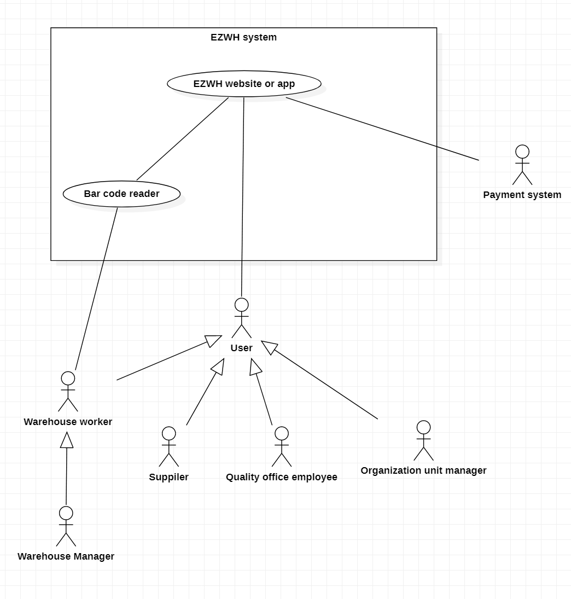

# Requirements Document 

Date: 30 march 2022

Version: 1.0

 
| Version number | Change |
| ----------------- |:-----------|
| 1 | Stakeholders, contex diagram, actors and interfaces | 

# Contents

- [Informal description](#informal-description)
- [Stakeholders](#stakeholders)
- [Context Diagram and interfaces](#context-diagram-and-interfaces)
	+ [Context Diagram](#context-diagram)
	+ [Interfaces](#interfaces) 
	
- [Stories and personas](#stories-and-personas)
- [Functional and non functional requirements](#functional-and-non-functional-requirements)
	+ [Functional Requirements](#functional-requirements)
	+ [Non functional requirements](#non-functional-requirements)
- [Use case diagram and use cases](#use-case-diagram-and-use-cases)
	+ [Use case diagram](#use-case-diagram)
	+ [Use cases](#use-cases)
    	+ [Relevant scenarios](#relevant-scenarios)
- [Glossary](#glossary)
- [System design](#system-design)
- [Deployment diagram](#deployment-diagram)

# Informal description
Medium companies and retailers need a simple application to manage the relationship with suppliers and the inventory of physical items stocked in a physical warehouse. 
The warehouse is supervised by a manager, who supervises the availability of items. When a certain item is in short supply, the manager issues an order to a supplier. In general the same item can be purchased by many suppliers. The warehouse keeps a list of possible suppliers per item. 

After some time the items ordered to a supplier are received. The items must be quality checked and stored in specific positions in the warehouse. The quality check is performed by specific roles (quality office), who apply specific tests for item (different items are tested differently). Possibly the tests are not made at all, or made randomly on some of the items received. If an item does not pass a quality test it may be rejected and sent back to the supplier. 

Storage of items in the warehouse must take into account the availability of physical space in the warehouse. Further the position of items must be traced to guide later recollection of them.

The warehouse is part of a company. Other organizational units (OU) of the company may ask for items in the warehouse. This is implemented via internal orders, received by the warehouse. Upon reception of an internal order the warehouse must collect the requested item(s), prepare them and deliver them to a pick up area. When the item is collected by the other OU the internal order is completed. 

EZWH (EaSy WareHouse) is a software application to support the management of a warehouse.

# Stakeholders

| Stakeholder name  | Description | 
| ----------------- |:-----------:|
|   Retailers/Medium companies 	|	Companies that resell products   | 
|	Warehouse manager		| 	Person who manages the warehouse and issues orders	|
|	Warehouse owner			|	Person who owns the warehouse	|
|	Quality office			|	Internal office of the warehouse who applies specific tests to items to check their quality	|
|	Marketing office		|	Internal office of the warehouse who is in charge to collect the orders from the OUs	|
|	Organization units		|	Parts of the company that issue orders to the warehouse		|
|	Suppliers				| 	Companies that firstly sell the products	|
|	Delivery companies		|	Companies that manage the transport of the items from the suppliers to the warehouse and eventually from the warehouse to the OUs	|
|	Warehouse workers		|	Persons that work inside the warehouse, they manage the placement of the products inside the warehouse|
|   Payment system | Companies that provide payment services |
|   Start up partner | Company that has subscribe a partnership with the application |
|   Start up financer | Entities that finance the application |
|   Competitors | Other applications focused on the same topic |
|   Play store/App store | Online app stores where the application is sold |
|   Cloud service | The company that provides cloud services |

# Context Diagram and interfaces

## Context Diagram
\<Define here Context diagram using UML use case diagram>

\<actors are a subset of stakeholders>

## Interfaces
\<describe here each interface in the context diagram>

\<GUIs will be described graphically in a separate document>

| Actor | Logical Interface | Physical Interface  |
| ------------- |:-------------:| -----:|
|  Warehouse manager  | GUI | Screen, keyboard |
|  Quality office	| GUI | Screen, keyboard |
|  Suppliers	| GUI | Screen, keyboard |
|  Payment system | API | Internet connection |
|  Organizational units | GUI | Screen, keyboard |

# Stories and personas
\<A Persona is a realistic impersonation of an actor. Define here a few personas and describe in plain text how a persona interacts with the system>

\<Persona is-an-instance-of actor>

\<stories will be formalized later as scenarios in use cases>

# Functional and non functional requirements

## Functional Requirements

\<In the form DO SOMETHING, or VERB NOUN, describe high level capabilities of the system>

\<they match to high level use cases>

| ID        | Description  |
| ------------- |:-------------:| 
|  FR1     |  |
|  FR2     |  |
| FRx..  | | 

## Non Functional Requirements

\<Describe constraints on functional requirements>

| ID        | Type (efficiency, reliability, ..)           | Description  | Refers to |
| ------------- |:-------------:| :-----:| -----:|
|  NFR1     |   |  | |
|  NFR2     | |  | |
|  NFR3     | | | |
| NFRx .. | | | | 

# Use case diagram and use cases

## Use case diagram
\<define here UML Use case diagram UCD summarizing all use cases, and their relationships>

\<next describe here each use case in the UCD>
### Use case 1, Issue orders to suppliers
| Actors Involved        |  |
| ------------- |:-------------:| 
|  Precondition     | \<Boolean expression, must evaluate to true before the UC can start> |
|  Post condition     | \<Boolean expression, must evaluate to true after UC is finished> |
|  Nominal Scenario     | \<Textual description of actions executed by the UC> |
|  Variants     | \<other normal executions> |
|  Exceptions     | \<exceptions, errors > |

##### Scenario 1.1 

\<describe here scenarios instances of UC1>

\<a scenario is a sequence of steps that corresponds to a particular execution of one use case>

\<a scenario is a more formal description of a story>

\<only relevant scenarios should be described>

| Scenario 1.1 | |
| ------------- |:-------------:| 
|  Precondition     | \<Boolean expression, must evaluate to true before the scenario can start> |
|  Post condition     | \<Boolean expression, must evaluate to true after scenario is finished> |
| Step#        | Description  |
|  1     |  |  
|  2     |  |
|  ...     |  |

##### Scenario 1.2

### Use case 2, Quality check report
| Actors Involved        | Quality office  |
| ------------- |:-------------:| 
|  Precondition     | An order has arrived at the warehouse |
|  Post condition     | Quality report is inserted in the on the application |
|  Nominal Scenario     | The order is compliant with quality standards |
|  Variants     |  |
|  Exceptions     | 1.The order has damaged items  2.The order is missing items  |

#### Scenario 2.1 

Nominal scenario: the order is compliant with the requests

| Scenario 2.1 | |
| ------------- |:-------------:| 
|  Precondition     | An order has arrived at the warehouse |
|  Post condition     | A positive quality report is inserted in the on the application |
| Step#        | Description  |
|  1     | The quality office employee logs in the application |
|  2     | The quality office employee gets the information on the order they will be inspecting |
|  3     | The quality office employee inspect the items in the order, checking thay they respond to the order on the application |  
|  4     | All the items are as described in the order and in the right quantities |
|  5     | The quality office employee logs in the application the positive quality check on the order page |

#### Scenario 2.2 

Exception scenario: the order has damaged items

| Scenario 2.2 | |
| ------------- |:-------------:| 
|  Precondition     | An order has arrived at the warehouse |
|  Post condition     | A negative quality report is inserted in the on the application |
| Step#        | Description  |
|  1     | The quality office employee logs in the application |
|  2     | The quality office employee gets the information on the order they will be inspecting |
|  3     | The quality office employee inspect the items in the order, checking thay they respond to the order on the application |  
|  4     | Some items are damaged |
|  5     | The quality office employee logs in the application the negative quality check on the order page, where the damaged items and their quantity is specified |

#### Scenario 2.3 

Exception scenario: the order is missing items items

| Scenario 2.3 | |
| ------------- |:-------------:| 
|  Precondition     | An order has arrived at the warehouse |
|  Post condition     | A negative quality report is inserted in the on the application |
| Step#        | Description  |
|  1     | The quality office employee logs in the application |
|  2     | The quality office employee gets the information on the order they will be inspecting |
|  3     | The quality office employee inspect the items in the order, checking thay they respond to the order on the application |  
|  4     | Some items are missing compared to the order on the application |
|  5     | The quality office employee logs in the application the negative quality check on the order page, where the missing items and their quantity is specified

### Use case 3, Manage internal orders

### Use case 3.1, Issue internal order

| Actors Involved        | OU Manager |
| ------------- |:-------------:| 
|  Precondition     | OU Manager is authenticated and authorized |
|  Post condition     | Order is sent to the Warehouse's DB with status "on pending" |
|  Nominal Scenario     | 1. OU Manager asks for item(s) in the WH 2. Application checks if item(s) asked are in stock 3. Application sends order to the WH	|
|  Variants     | 1. OU Manager uses "last order" function to ask for item(s) 2. same 3. same	|
|  Exceptions     | all the items asked(quantity) are not in stock some of the items asked are not in stock, OU Manager continues order excluding those some of the items asked are not in stock, OU Manager cancels order |

| Scenario 1.1 | |
| ------------- |:-------------:| 
|  Precondition     | OU Manager is authenticated and authorized |
|  Post condition     | Order is sent to the Warehouse's DB with status "on pending" |
| Step#  | Description  |
|  1     | OU manager asks for item(s) in the warehouse |  
|  2     | Application asks the quantity of the item(s) needed |
|  3	 | User enter the quantity and confirms |
|  4	 | Application checks if the quantity asked for each item is in stock or not |
|  5 	 | Application sends the order to the WH |

| Scenario 1.2 | |
| ------------- |:-------------:| 
|  Precondition     | OU Manager is authenticated and authorized |
|  Post condition     | Order is sent to the Warehouse's DB with status "on pending" A notification regarding this order is sent to the Warehouse Manager |
| Step#  | Description  |
|  1     | OU manager asks for items in the warehouse |  
|  2     | Application asks the quantity of the items needed |
|  3	 | User enter the quantity and confirms |
|  4	 | Application checks if the quantity asked for each item is in stock or not |
|  5 	 | Application notifies that the quantity asked for some of the items is not in stock |
|  6	 | Application asks if you want to continue your order excluding the missing item(s) from the request |
|  7 	 | User confirms |
|  8 	 | Application sends the order and the notification to the WH Manager |

| Scenario 1.3 | |
| ------------- |:-------------:| 
|  Precondition     | OU Manager is authenticated and authorized |
|  Post condition   | A notification regarding this order is sent to the Warehouse Manager |
| Step#  | Description  |
|  1     | OU manager asks for items in the warehouse |  
|  2     | Application asks the quantity of the items needed |
|  3	 | User enter the quantity and confirms |
|  4	 | Application checks if the quantity asked for each item is in stock or not |
|  5 	 | Application notifies that the quantity asked for some of the items is not in stock |
|  6	 | Application asks if you want to continue your order excluding the missing item(s) from the request |
|  7 	 | User rejects |
|  8	 | Application sends the notification to the WH Manager |

\<The notification tells the WH Manager the need to order the item(s) from a supplier to satisfy this request>

| Scenario 1.4 | |
| ------------- |:-------------:| 
|  Precondition     | OU Manager is authenticated and authorized |
|  Post condition     | A notification regarding this order is sent to the Warehouse Manager |
| Step#  | Description  |
|  1     | OU manager asks for item(s) in the warehouse |  
|  2     | Application asks the quantity of the item(s) needed |
|  3	 | User enter the quantity and confirms |
|  4	 | Application checks if the quantity asked for each item is in stock or not |
|  5 	 | Application notifies that the quantity asked for each of the items is NOT in stock |
|  6	 | Application sends the notification to the WH Manager |

| Scenario 1.5 | |
| ------------- |:-------------:| 
|  Precondition     | OU Manager is authenticated and authorized |
|  Post condition   | Order is sent to the Warehouse's DB with status "on pending" |
| Step#  | Description  |
|  1     | OU Manager asks to redo the last order and confirms |  
|  2	 | Application checks if the quantity asked is in stock or not |
|  3 	 | Application sends the order to the WH|

\1.6, 1.7, 1.8 not sure if needed
| Scenario 1.6 | |
| ------------- |:-------------:| 
|  Precondition     | OU Manager is authenticated and authorized |
|  Post condition   | A notification regarding this order is sent to the Warehouse Manager Order is sent to the WH's DB with status "on pending" |
| Step#  | Description  |
|  1     | OU Manager asks to redo the last order and confirms |  
|  2	 | Application checks if the quantity asked is in stock or not |
|  3 	 | Application notifies that the quantity asked for some of the items is not in stock |
|  4	 | Application asks if you want to continue your order excluding the missing item(s) from the request |
|  5 	 | User confirms |
|  6 	 | Application sends the order and the notification to the WH Manager |

### Use case 3.2, Prepare internal order

| Actors Involved        | WareHouse Worker |
| ------------- |:-------------:| 
|  Precondition | An internal order is issued WH Worker is authenticated and authorized |					
|  Post condition     | Order status has been changed OU Manager has been notified  |
|  Nominal Scenario     | 1. WH Worker accepts and prepare order 2. Application change order status to  "Preparing" 3. WH Worker notifies completion of order 4. Application change order status to "Completed"  and sends to the OU Manager a notification|
|  Variants     | 						|
|  Exceptions     | order is rejected for whatever reason |
			
| Scenario 1.1 | |
| ------------- |:-------------:| 
|  Precondition     | An internal order is issued WH Worker is authenticated and authorized |
|  Post condition     | Order status is "Completed" The OU Manager is notified |
| Step#  | Description  |
|  1     | WH Worker accepts the order and starts preparing the item(s) |  
|  2     | Applications changes order status to "Preparing"  |
|  3	 | When item(s) are in the pick-up area, WH Worker notifies the application |
|  4	 | Application changes order status to "Completed" |
|  5     | Application notifies the OU Manager |

\ can this happen? 
| Scenario 1.2 | |
| ------------- |:-------------:| 
|  Precondition     | An internal order is issued WH Worker is authenticated and authorized |
|  Post condition     | Order status is "Cancelled" The OU Manager is notified |
| Step#  | Description  |
|  1     | WH Worker rejects the order |  
|  2     | Applications changes order status to "Cancelled"  |
|  3     | Application notifies the OU Manager |

### Use case 4, Manage storage of items

### Use case 5, Refound

# Glossary

\<use UML class diagram to define important terms, or concepts in the domain of the system, and their relationships> 

\<concepts are used consistently all over the document, ex in use cases, requirements etc>

# System Design
\<describe here system design>

\<must be consistent with Context diagram>

# Deployment Diagram

\<describe here deployment diagram >

